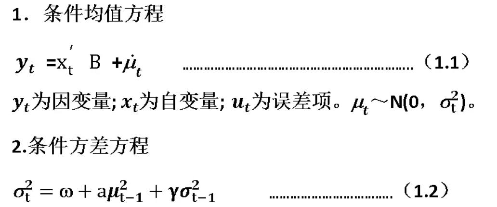
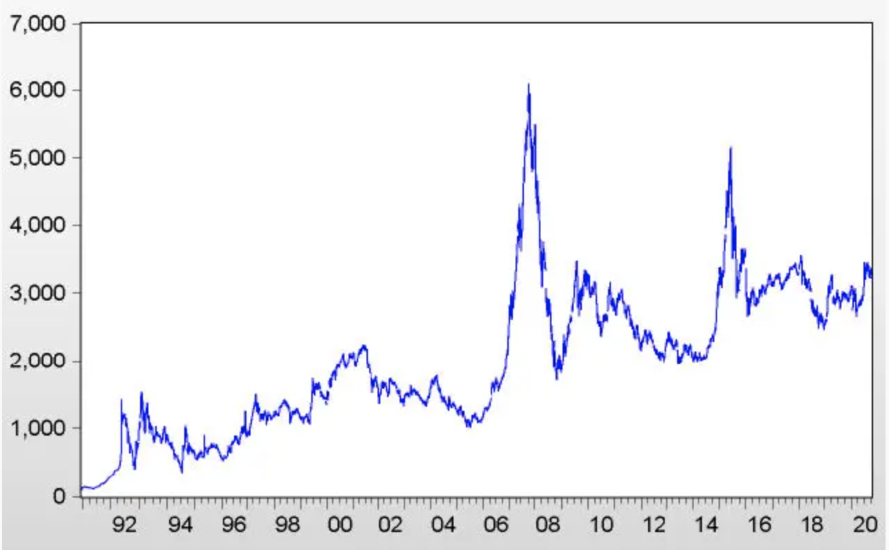
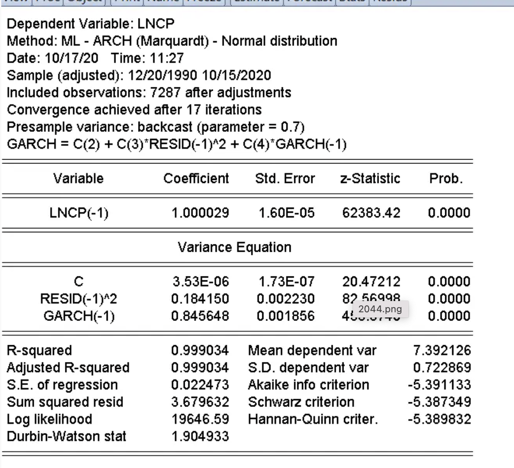
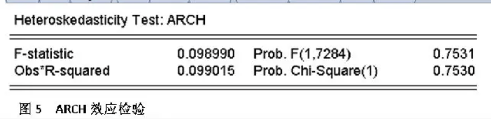
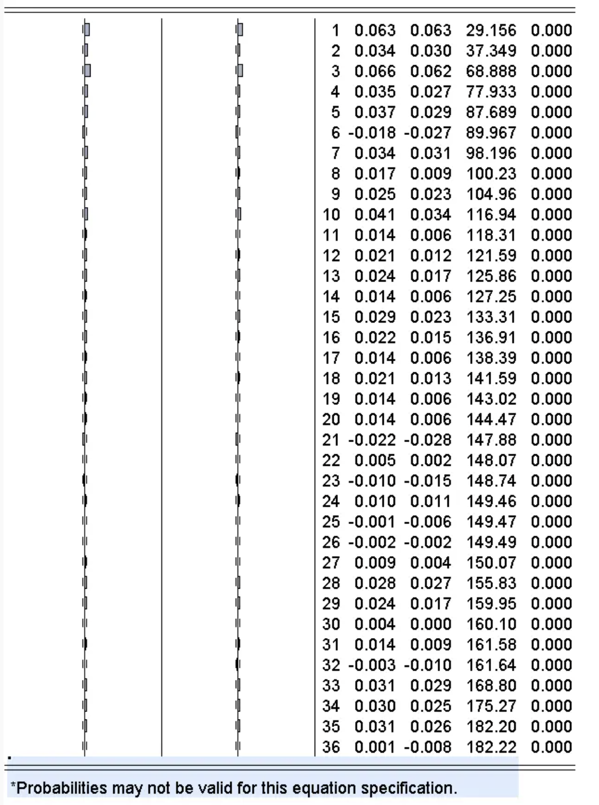
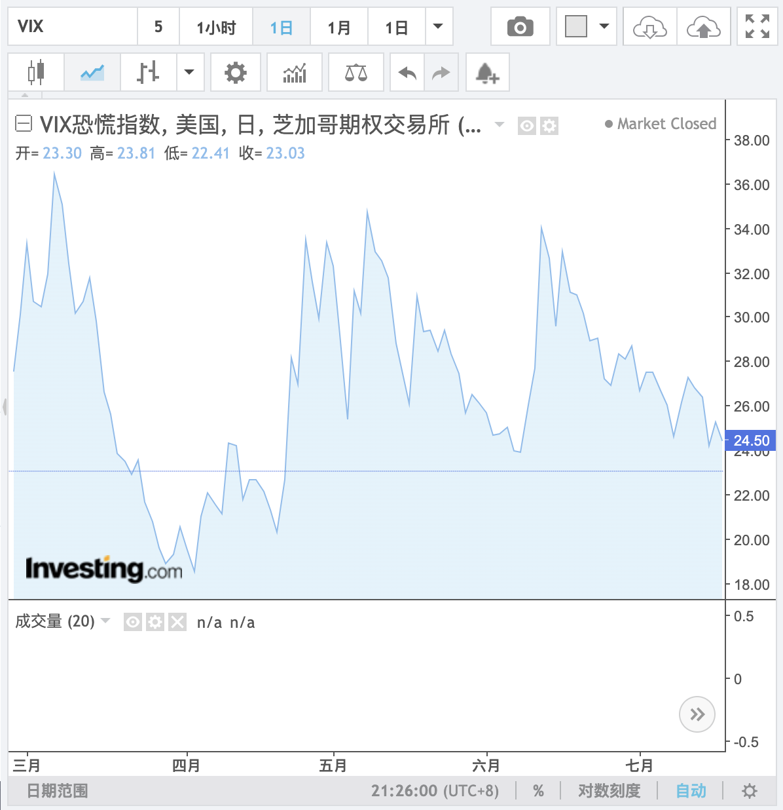

	波动率在经济周期中分析预测

### 一. 摘要Abstract

随着金融产品的创新，波动率成为衍生品定价与风险管理技术中最关键的参数之一。无论是交易期权，或是交易更加复杂的金融衍生品，需要对交易产品未来的波动水平进行预测，，其有多种不同的波动率衡量方法：

有不同的波动率衡量方法：

	1.实际波动率：由Anderson提出的，通过对特定频率分时数据的平方和来估计真实波动率。
	2.历史波动率：对标的资产在过去某一段时间的价格变化进行统计分析得出的波动率。通通常使用的历史波动率是通过计算金融资产过去一段时间内日收益率的标准差所得到的，常用的有30日，60日，120日历史波动率。
	3.隐含波动率：将期权价格代入BS期权定价模型反推出来的波动率，表现的是投资者对标的资产未来波动率的预期。
	4.真实波动幅度均值（ATR，average true range）：J. Welles Wilde于1978年在《New Concepts in Technical Trading Systems》中提出，TR为以下三取最大值：最高价-最低价，最高价-昨收，昨收-最低价。ATR是TR在N日内的简单移动平均。通常N取14.

2022年疫情进入第三年, 俄乌战争爆发, 能源危机, 无论是全球经济与中国经济都无法避免的遭遇到经济衰退的挑战。如何通过波动率的理论/模型/指标的应用来分析与预测未来的经济发展趋势是本文的主要内容。其中包括VIX波动率指数/GARCH模型/改进GARCH模型等。通过波动率的实例分析来观察经济形势和资本市场的动态变化。

### 二. 波动率理论分析

波动率(volatility)是指变量随时间序列而呈现 的扰 动 ，是对某资产收益不确 定性 和风险 的衡量 指标 。波动率通 常用 样本的标准差或方差来表示 ，样本标准差是描述 样本二阶矩特征的统计量 ，表 示样本的离中趋 势 ，可作为风险的评价尺度(Markowitz，1952)，并被广泛运用到金融资产的风险评价当中，故波动率在金融经济研究中是非常重要的变量 ，投资组合选
择 、资产定价以及风险管理, 包括经济形势的判断都离不开对波动率的准确度量 。经济学中 ，随机波动侧重指时间序列的随机(不可观测)部分(Andersen,Bollerslev,Kristoferson,Diebold,2005)；而金融学中,随机波动性是指在一个连续 的差分模型中随机维纳 (Wiener)部分的标准差或协方差。对此 ，Poon、Granger(2003)强调, 更为准确的分析需采用标准差或协方差来界定和计算, 并 以时间序列是某种条件分布为前提 ，如正态分布 、t分 布或者 是非标准分布 ，需要通过其对应的概率密度 、累计概率密度才可以从历史数据中推导出来。

理论上界定和推证了随机波动是收益率的方差 ，就需要在实证上获得收益率的数据来建模 、检验和诠释 。在成熟的金融市场上，存在三类可获得数据的波动性：一是历史波动(historical volatility)，就是目标资产在研究视线窗内客观的历史数据时表现出的波动特征。这是基础数据 ，也是早期研究 的重点 ，适用于AR、ARMA、ARCH、GARCH和SV。二是隐含波动(implied volatility)，在金融期权 的定价模型中，波动率的估计和预测值是一个重要的影响变量。反过来 ，从实际交易中获得期权的价格数据 ，可以倒算推导出暗含在期权价格 、持有期限、执行价格等条件下波动率的值 ，这就是隐含波动。三是现实波动 (realised volatility)，又称高频数据 (high frequency data)波动 ，是指由于信息技术手段的提 高 ，可获得金融市场一天内(intraday)的交易数据 ，如5分钟 、1O分钟而呈现出的波动。高频数据的使用极大地提高了在不依赖直接模型条件下直接观测潜在波动的可能 ，也从实践上支撑并推动了SV模型 、连续波动性研究 ，同时为随机波动研究在金融市场的微观结构方面的应用提供了保障。

经典的波动性研究假设金融资产收益率服从正态分布 ，而在实证研究中许多经济学家尝试对汇率 的变动做出各种研究 ，认为收益率的波动呈现非均衡状态 ，表现出如下主要特征 ：
	1．尖峰厚尾特征 (，IhickTails)
	2．波动集群性 (VolatilityClustering)
	3．杠杆效应 (LeverageEfect)特征
	4．信息流 (InformationArrivals)特征
	5．长期记忆与持续性 (LongMemoryandPersistence)
	6．共生波动(Volatility Co—movements)特征
	7．溢出效应 (VolatilitySpillover)特征
	8．微笑现象 (Smiles)
	9．隐含的相关波动(ImpliedVolatilityCorrelations)

#### 波动性预测方法
金融资产价格的波动性问题最直接的实际指导意义就是为衍生品定价提供波动率预测值 ，所以随机波动的理论假设 、建模 、估计都是围绕最终模型为市场价格波动提供较准确的预测 。ARCH／GARCH、SV、结构制度转换 、阀值模型 、连续SV模型在预测上涉及到点预测 、区间预测 、发生概率 (含符号)预测和密度预测 。Patton(2005)指出在点预测绩效的评估上 ，由于SV模型中的扰动项不可观测 ，使得事后评估不能直接展开，只有采用替代措施。经过多年来众多学者的大量细致研究 ，针对波动率的估计模型已有了很大发展 ，其中包括 ：自回归移动平均模型(ARMA)，自回归条件异方差 (ARCH)族模型 、随机波动率模型(stochastic volatihty，SV)、Switch—Regime模型等等 。

Engle(1982)提出的ARCH模型以及Taylor(1986)提出的SV模型 ，被认为是最集中地反映了金融数据 时间序列方差波动特点的模型 ，成为现代经济计量学研究的重点 。ARCH模型是用于分析收益率与波动率的有效方法之一 ，它解释了收益率序列中比较明显的变化是否具有规律性 ，并且说明了这种变化前后依存的内在传导是来自某一特定类型的非线性结构 ，较好地刻画了外部 冲击形成的波动集聚性 。

Bollerslev(1986)修正了ARCH模型 ，在ARCH模型中加入了条件异方差的移动平均项 ，提出了GARCH模型。在实证分析中，经常使用的模型不是由 Engle提 出的原始ARCH模型 ，而是GARCH模型等原始模型的推广 ，不过这些模型的基本原理大致相同，都可采用最大似然法进行参数 估计 , 且参数的检验方法也相差无几 。同时实证结果表明，GARCH模型能更好地刻画收益率序列残差项的异方差性 ，国外学者利用GARCH模型进行了大量的研究 ，并对该模型进行了扩展和改进 。Engle、Lilien&Robbins(1987)将条件标准方差引入均值方程 ，进一步提出了GARCH-M模型 ，使期望收益率与风险紧密联系在一起 。Nelson(1991)提出指数 GARCH(exponential GARCH．EGARCH)模型 ，避免了对参数的非负性假设 。Pagan& Schwert(1990)发现相对于非参数模型而言 ，EGARCH模型的预测效果是最好的。Harvey、Ruiz&Sentana(1992)提出了结构性 ARCH(structural ARCH.STARCH)，这个模型要求用卡尔曼滤波进行估计 。

Taylor(1986)在解释金融收益序列波动的自回归行为时提出了随机波动 (stochastic volatility)模型 。SV模型简明的特点使它与GARCH模型相比表现出很多优势 ，实践证明SV模型可以较好地拟合金融数据 ，在金融分析 、风险预测等方面有着广泛的用途 。但是 ，在SV模型中波动变量是不可观测的隐变量(1atent variable)，要得到精确的样本似然函数是十分复杂和困难的 ，这使得在金融资产波动 的建模中SV模型远没有GARCH模型普及。

近年来 ，在随机波动性的模型估计方面取得了极大的进展 ，主要有用近似的或者模拟的方法构造模型的似然函数和无条件矩, 包括拟最大似然估计(QML)、广义矩估计(GMM)、仿真最大似然估计(SML)；模拟矩估计(SMM)等。Hmveyetal(1994)、Ruiz(1994)、Andersen＆Serensen(1997)提出了准最大似然估计(QuasiML)。将SV模型转换为状态空间形式 ，以正态分布作为扰动项渐进分布，采用卡尔曼滤波 (Katmallfilter)估计模型。Melino&Tumbull(1990)在汇率扩散模型中假设波动服从连续随机过程 ，运用广义矩估计(GMM)发现SV模型较好地拟合了实际数据 。Anderse＆ Serensen(1996，1997)，Dufle&Singleton(1993)、Singleton(2001)对SV模 型的广义矩估计也做了相应的研究 。Danielsson&Richard(1993)、Danielsson(1994)给出仿真极大似然方法 (simulatedMl)，首先根据样本信息采用重要抽样模拟技术(importance sampling simulation)，对隐含的波动随机过程进行仿真模拟 ，然后求出边际似然函数 ，其精度超过QML和GMM方法 ，但计算量很大。

在波动率模型的实践研究中，超高频数据分析(Hansen et al.（2012）提出了一种高频数据已实现测度与传统GARCH模型相结合的Realized GARCH模型) 、多元模型的建模和估计 、无条件分布的厚尾性以及波动的长期记忆性都已成为研究重点。

### 三. 波动率模型应用的股市分析

波动性(volatility)作为金融经济学研究的核心问题之一 ，对波动性的精确测量和预测不仅成为资产 定价 、衍生品的定价和交易策略设计的关键 ，也是人们理解和管理金融市场的主要指标 。关于波动性的方法模型被广泛运用于股票市场 、人民币汇率及其他各种金融衍生品的价格波动分析和预测当中。正由于GARCH模型能更好地刻画收益率序列残差项的异方差性, 以上证指数收盘价格的GARCH模型为实例来分析在经济形势波动情况的股市变化。

首先GARCH模型的基本思想是：用一个或两个方差滞后值代替许多u_t^2的滞后值。GARCH（1，1）的核心方程包括：

**数据准备**

“上证指数”全称为上海证券综合指数，其样本股是在上海证券交易所全部上市股票，包括A股和B股，反映了上海证券交易所上市股票价格的变动情况，自1991年7月15日起正式发布。我们根据《网易财经》个股行情数据收集了上指数 (000001)[1] 。从1990年12月19日至2020年10月15日近30年7289个开盘日的收盘价格数据。

我们将数据下载到Excel上，其中设时间的序列名为“t”,股票收盘价格的序列名为“cp”。由于股市并不是每日开盘，因而，将Excle文件导入到Eviews需要做一些特别操作。其步骤如下：

1990年12月19日至2020年10月“上证指数”收盘价格发展趋势图

**方程估计**
股票价格指数序列通常用一种特殊的单位根过程，即随机游动（Randomwalk）模型来描述，其表现形式为：y_t=y_(t-1)+u_t .同时，我们将序列cp变成自然对数形式，即设立一个新序列：

 Generate :lncp=log(cp)

点开lncp序列，进行方程估计，在对话框录入lncp  lncp(-1)

GARCH模型估计结果

由上图可见，变量的系数的p值均小于0.05的显著水平，不能拒绝原假设（H0），全部通过t检验。Adjusted R^2=0.999;Loglikelihood=19646.59;Durbin-Watson stat=1.905<2。

**ARCH效应检验**
步骤：View/Residual Test/ARCHLM Test,得图

由图可见，Obs*R-squared的卡方检验的相伴概率prob=0.8351>0.05（显著水平）。拒绝原假设，说明lncp序列不存在ARCH效应。

**ARCH模型的残差独立性检验**
步骤：View/Residual Test/Correilogram –Q-statistics,给出滞后阶数32，确定，得图

ARCH模型的残差独立性检验

 由上图可见，Q统计量的相伴概率均小于0.05（显著性水平），拒绝原假设（H0）

上证指数从1990年12月19日至2020年10月15日近30年、**7289**个开盘日的收盘价格。以此建立上证指数收盘价格的GARCH模型。

上述第一个方程是条件均值方程，第二个方程是条件方差方程。方程下圆括号内的值是z统计量。模型的拟合度较优。ARCH效应检验，表明模型并不存在ARCH效应。模型的残差独立性检验。

这里所称谓的均值（数学期望），就是上证指数的平均数；方差是反映观察值偏离平均数的情况，学术用语称之为“**风险**”。“t-1”是表示上一时期。在我们的这个案例中，比如，“t”是2020年10月15日，t-1是2020年10月14日。由此类推。由上式的条件方差方程来看，影响现在方差的因素中，均值发生偏离的影响只有0.00000353；残差平方的系数或倍数为0.184；上一期方差的系数或倍数为0.846。

实证结果表明，上证指数收益率序列具有显著的异方差特征，并且可以采用 GARCH( 1，1) 模型对时间序列的波动性进行很好的拟合和解释。这说明，上证指数收益率的波动大小，即总体风险都与其各自过去的波动大小有很明显的关系，也就是说，上证指数收益率的波动，其条件方差序列都是“长记忆”型的，且聚集特征非常明显。

### 四. 经济周期的VIX波动率指数实例-2022

CBOE发布的波动率指数VIX与经济形势密切相关, 经常被市场称为恐慌指数。我们可以通过VIX指标的变化来分析2022年以来的经济形势由盛转衰再走向平稳的过程。

	较高的VIX表明：交易者预计标准普尔500指数将变得更加波动和压力。
	较低的VIX表明：期权交易者预期标准普尔500指数波动较小且更稳定。

VIX指数是衡量[标普500指数](http://stockdata.stock.hexun.com/qqgz/index.aspx?code=.INX)期权的隐含波动率指数，通常取自期权合约期满日超过23日且不超过37天的数据，以此了解到市场对未来30天波动性的预期。。从历史上看，隐含波动率的走势在80%时间里都与相反。

**基于历史数据得出结论的,即使2022年经济衰退,VIX指数可能依然保持低波动。因为目前其读数为29%，已经超过了在过去13次经济衰退中11次的峰值水平。** 美股6月的反弹幅度已经迫使看空者疯狂地平仓以限制损失, 同时验证的VIX指数低位的合理性。实际波动率以及隐含波动率之间的关系是可预测的，因此若市场波动趋于平静，也会导致VIX指数维持在较低的水平。

在[标普500](http://stockdata.stock.hexun.com/qqgz/index.aspx?code=.INX)被疯狂抛售或是经济陷入衰退的周期里，有很多情况下是实际波动率远低于30，甚至是低于20，**因此低于20的VIX指数在经济明显下行的2022年是可观测到的。**

VIX指数从202年6月下旬以来连续下跌，收于23附近，接近三个月低点。尽管此前美股屡创新低，但VIX指数自3月见顶以来就停止飙升，**引发了对其作为恐惧晴雨表的作用的怀疑**。而其他资产，尤其是低迷的美债，股票市场严重低估了经济衰退的风险。**美债波动加剧可能将推升VIX指数。在一定程度上由流动性不足推动的高利率波动，应该会为股票波动性提供一条底线，尤其是考虑到今年股价与资金成本变化之间的紧密联系。

2022年全球央行(美联储/欧洲央行等)都开始实行货币紧缩政策的行列，数据显示美国经济疲软，以及投资者重新评估了最新的企业财报和经济增长前景，在明确经济下行的情况, 股市周四小幅收涨, VIX继续保持低位。

​		一般来说，VIX短期影响因素均是突发性的“黑天鹅”事件，长期影响因素则是系统性的“灰犀牛”事件。VIX指数主力在2022年7月份合约于再度走低，较同期表现震荡的美股呈现出相悖之势，在于市场对“黑天鹅”事件发生的较高情绪表现，目前来看，地缘政治风险或超预期的宏观数据表现是市场最大的担忧。

　　从VIX的编制原则来看，影响走势的主要因素与影响股市未来预期因素有关，因此，当市场对股市未来的担忧越大，VIX指数走高概率越大，但从这次该指数走低来看，同期美股表现震荡，并未有剧烈波动之势。说明影响VIX指数的美联储政策、美股波动率，以及地缘政治风险等因素, 已有部分释放和消化。在没有超出市场预期的措施出台(突发性的“黑天鹅”事件,例如全球金融危机)前, VIX指数走低时可以预料的。

　　大宗商品或维持弱势行情

　　VIX指数虽然主要反映海外标普500股票市场，但从影响因素来看，无论是短期或中长期因素，都会对商品市场产生影响，甚至对部分龙头品种产生较大的影响，例如美联储加息对国际金价的影响等。

　　通常来看，通胀水平越高，市场将通胀视为担忧，股市下跌而引发VIX指数大幅上涨。但此次VIX指数走势与海外市场通胀表现相悖，根本原因是市场选择将风险逐步释放，对于美股股指的预期下跌达成共识。“美股市场虽然转熊还未达到恐慌，但资金已经在寻求避险，VIX指数提前反映。”

　　“当前大宗商品价格中枢持续下移，美元指数走强，美联储加息步伐仍在加快，VIX指数大幅波动下，可能会进一步压低大宗商品价格。”2022年以来的VIX指数下跌，可能在于宏观政策波动或地缘政治风险，以原油为代表的能源类商品或迎来较明显投资机会。

　　VIX指数可以有效地衡量市场风险与情绪，对于大宗商品的走势亦有一定的反作用力，但当大宗商品趋势性上涨或者下跌之际，VIX指数的相互影响有限，大宗商品投资机会的主逻辑依然是宏观经济变化。目前来看，美国经济衰退的风险在不断升温，经济衰退交易逻辑、大宗商品整体弱势将会持续，逢高沽空策略依然合适。
　　

### 五. 小结

借助GARCH类模型对上证指数进行深度分析可知：

1.使用带厚尾分布（student-t）的GARCH族模型的对上证指数收益率的拟合要优于带正态分布的GARCH模型。

2.股市指数具有很强的波动集聚性和持续性。股市波动具有典型的时变性、簇集特征，这表明在波动的内在传导过程中，过去的股价变动对未来的股价波动有强烈的影响。

3.股票价格波动的短期记忆性及波动与风险存在正相关。

VIX波动率指数在2022年经济周期内的分析可知：

1.经济陷入衰退的周期里, 有很多情况下是实际波动率远低于30，甚至是低于20，因此当前23左右的VIX指数在经济明显下行的前提下是合理的。而非部分交易者判断的VIX恐慌指数还将高企

2.从影响因素来看，无论是短期或中长期因素，VIX都会对中概股/大宗商品市场/全球投融资市场带来产生影响，甚至对部分龙头品种产生较大的影响。

通过对波动率模型应用在长周期内股市分析与经济周期内的VIX波动率指数分析预测,我们可以发现使用波动率模型应用与VIX波动率指数分析等方式可有效观测经济繁荣与衰退的变化的相关性, 但往往在由于经济活动与资本市场受到外部环境因素影响较多(包括战争，能源，金融危机等), 导致波动率在经济周期中分析与预测需要综合多种当时因素的整体判断与预测。

### Reference

- THE CBOE VOLATILITY INDEX® - VIX White Paper
- An Approach To Time Series Analysis By [E Parzen](https://xueshu.baidu.com/s?wd=author%3A(E Parzen) &tn=SE_baiduxueshu_c1gjeupa&ie=utf-8&sc_f_para=sc_hilight%3Dperson)
- 波动率交易：期权量化交易员指南 By [Euan Sinclair](https://book.douban.com/subject/27057344/)
- Elements of Financial Risk Management. Elsevier Science (USA). By Christoffersen, Peter F. 2003. 
- Time Series Analysis with Applications in r. 2nd Ed. Springer. By Cryer, Jonathan D., and Kung-Sik Chan. 2008. 
- 应用计量经济学—时间序列分析  [美]A.H.施图德，2017. [M]. 杜江，袁景安，译.机械工业出版社。

