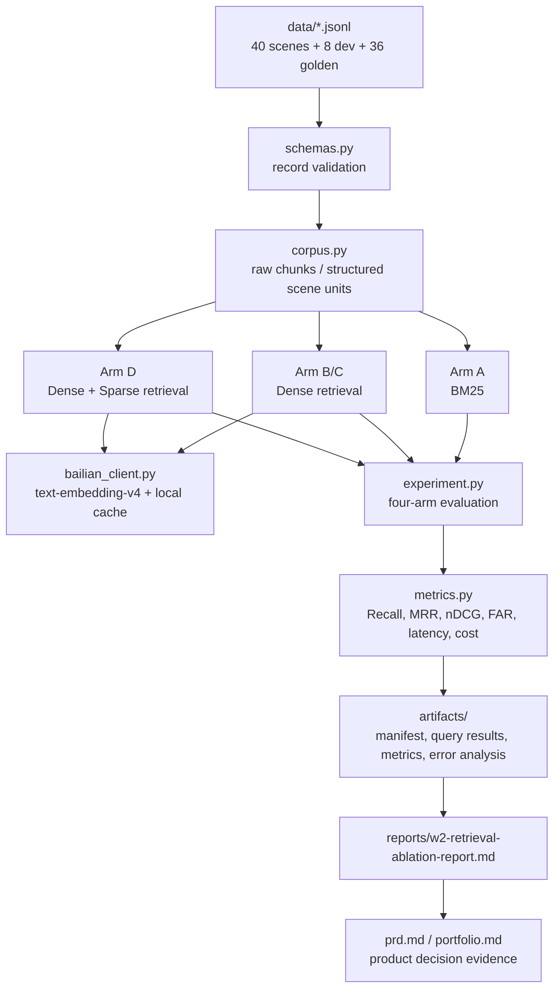

# 企业级多模态场景知识 Agent：W2 检索实验

本目录实现 W2 四组消融实验，用真实阿里云百炼 Embeddings API 比较关键词、文本向量、结构化场景和混合检索。

## 数据边界

- 40 个智驾测试场景全部为合成数据；
- 只复用 MBA 论文的方法框架，不复制论文正文、企业名称和实验指标；
- 结果只用于产品原型方向判断，不构成真实道路安全结论；
- 8 条开发查询用于选择混合权重和拒答阈值；
- 36 条黄金查询冻结后不得参与调参。

## 四个实验组

| 组 | 数据表示 | 检索方式 |
|---|---|---|
| A | 原始文档块 | BM25 |
| B | 原始文档块 | `text-embedding-v4` Dense |
| C | 结构化场景单元 | `text-embedding-v4` Dense |
| D | 结构化场景单元 | `text-embedding-v4` Dense + Sparse |

B/C 只改变数据表示；C/D 只增加 Sparse 融合。Dense 维度固定为 1024，D 组混合权重只能从 `0.5/0.7/0.8` 中通过开发集选择。

## 架构链路



## 设计决策

- **零第三方依赖**：实验框架只使用 Python 标准库，降低作品集复现门槛。
- **真实 API 默认跳过**：离线单元测试不产生百炼调用费用；只有显式设置 `RUN_BAILIAN_INTEGRATION=1` 才执行真实集成测试。
- **向量缓存不进 Git**：`.cache/embeddings/` 只保存本地复用数据，避免把运行态产物混入证据代码。
- **产物可只读复核**：`--verify-only` 校验 manifest、指标和逐查询结果，让报告引用的证据可以复查。
- **PRD 不夸大结论**：W2 只证明原型方向，不把合成数据结果表述为生产道路安全效果。

## 运行要求

- Python 3.9 或更高版本；
- 阿里云百炼中国内地 API Key，放入 `DASHSCOPE_API_KEY`；
- 不需要安装第三方 Python 包。

API Key 只能通过环境变量传入，不会进入代码、日志、缓存或实验产物。

## 命令

从本目录运行：

```bash
# 从仓库根目录执行完整离线检查
make check

# 全部离线测试；真实 API 测试默认跳过
python3 -m unittest discover -s tests -v

# 显式执行一次真实 Dense+Sparse API 检查
RUN_BAILIAN_INTEGRATION=1 python3 -m unittest tests.test_bailian_integration -v

# 确认冻结数据未被手工修改
python3 scripts/build_dataset.py --check

# 运行完整四组实验
python3 -m src.experiment --data-dir data --artifact-dir artifacts --price-per-1k 0.0005

# 只读复核已有产物
python3 -m src.experiment --verify-only --data-dir data --artifact-dir artifacts

# 显式刷新向量缓存，会重新调用并产生费用
python3 -m src.experiment --data-dir data --artifact-dir artifacts --price-per-1k 0.0005 --refresh-embeddings
```

## 缓存与费用

向量缓存保存于 `.cache/embeddings/`，缓存键包含模型、维度、输出类型和输入文本 SHA-256。默认运行会复用缓存；只有 `--refresh-embeddings` 才主动重新调用。

费用公式：

```text
费用（元）= 输入 Token ÷ 1000 × 运行当日每千 Token 单价
```

运行完整实验前必须核对阿里云官方当日价格，并通过 `--price-per-1k` 明确传入。报告区分一次性语料向量化成本与查询边际成本。

## 产物

`artifacts/` 生成：

- `run-manifest.json`：Git commit、数据哈希、模型参数、权重、阈值、用量和状态；
- `query-results.jsonl`：四组 × 36 条查询的完整排名、分数、指标和时延；
- `metrics.json`：总体指标、查询类型切片和三项关键差值；
- `error-analysis.md`：每组至少三个失败或低 nDCG 薄弱案例。

缓存和原始 JSON/JSONL 运行产物默认不纳入 Git。正式证据报告只引用通过 `--verify-only` 校验的产物。
