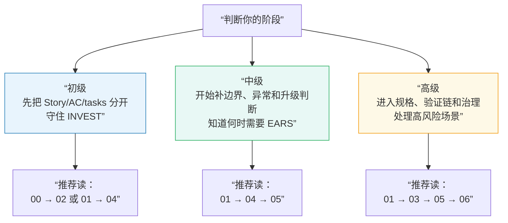

# AI 时代需求工程导读

这套交付物不是一份“大而全”的总报告，而是一组分工清楚的文档。

原因很简单：工程师、传统 PM、架构师、技术管理者面对的不是同一个认知任务。有人先需要建立整体地图，有人先需要学会迁移现有写法，有人则必须处理规格、验证、治理和 agent 工作流这些更硬的问题。把这些任务全塞进一份正文，只会让入门读者吃不下，也让高级读者觉得不够用。

这组文档的共同目标，是帮助团队把需求表达从“单一模板思维”升级成一套分层、可追溯、可执行的体系，让需求既能被人读懂，也能被工程流程和 coding agent 正确消费。

## 先看学习路线

如果你是第一次接触这套主题，先不要试图一口气把整张地图吃完。更稳的读法不是”从头顺序读到尾”，而是先判断自己现在处在哪个阶段。

这张图展示了三个阶段的学习路径：初级先建立分层意识，中级开始处理边界和异常，高级才进入完整的规格与治理体系。

### 初级：先把最少但最关键的几件事做对

你现在只需要先做到：

- 不再把 `Story`、`AC / Examples`、`tasks` 混写成一份万能文档
- 知道 `User Story` 的正式质量锚点是 `INVEST`
- 先写对一条 Story，先补出 1-2 条真正可验证的 AC

先别急着考虑：

- 复杂 `EARS` 模式
- `DMN / decision table`
- `traceability`
- `governance`

### 中级：开始补边界、异常和升级判断

当你已经能把 Story 与 AC 分开，就该开始琢磨：

- 什么样的 Story 虽然有价值，但还不够 `Testable`
- 异常、降级、NFR、接口边界何时该从 AC 升级到契约层
- 为什么 feature 细节不该继续堆进 `AGENTS.md` 或 rules

### 高级：再进入规格、验证链和治理

这些通常不是首轮阅读义务，而是你在下面情况才需要认真进入的主题：

- 高风险或高合规场景
- 多团队依赖
- 决策逻辑复杂
- 需要 contract -> validation -> workflow -> traceability 的闭环

## 再看文件地图

| 文件 | 推荐阶段 | 首轮是否必读 | 这份文档帮你解决什么问题 | 现在可以先跳过什么 |
| --- | --- | --- | --- | --- |
| `00-reading-guide.md` | `初级` | `是` | 帮你快速判断先看什么、怎么读整包 | 无；这是整包导航页 |
| `01-main-guide.md` | `初级 -> 中级` | `是` | 建立整套分层需求表达体系的共享心智模型 | 首轮不必强吃所有高级升级信号 |
| `02-pm-guide.md` | `初级` | `是（对 PM）` | 把 PRD / Story / AC 写法升级到更可执行的层次 | 深规格、治理和高级工作流细节 |
| `03-spec-architecture-guide.md` | `高级` | `否` | 讲清规格、验证、agent 工作流、治理如何连起来 | 如果你还在练 Story 和 AC，可先跳过 |
| `04-user-story-examples.md` | `初级 -> 中级` | `是` | 用正例、反例和重构练习学会写更好的 Story，解决"Story 怎么别写空""AC 怎么写得可接住"的问题。**本文是INVEST框架的权威定义** | 高级平台/风险类样例可第二轮再看 |
| `05-ears-examples.md` | `中级 -> 高级` | `否` | 用模式、边界和重构练习学会写更稳的 EARS。**本文是EARS五种模式的权威定义** | 首轮不必全文掌握 |
| `06-reference-appendix.md` | `查阅层` | `否` | 提供术语、标准/工具映射和进一步阅读入口 | 首轮可整体跳过 |
| `07-glossary.md` | `查阅层` | `否` | 把所有专业术语、缩写和概念逐一讲清楚，遇到不熟悉的词来这里查 | 首轮可整体跳过，按需查阅 |
| `08-quick-reference.md` | `查阅层` | `否` | **新增**：提供可打印的参考卡片，包括Story自检卡、EARS模式速查、升级决策卡 | 首轮可跳过，需要时查阅 |

第一次接触时，更稳的默认路线是：

1. 先看 `00`
2. 再看 `01` 或 `02`
3. 再进 `04`
4. 只有当你已经遇到轻量表达不够的问题时，再进 `05` 或 `03`
5. 需要快速查询时，用 `08` 的参考卡片

## 按读者角色选择阅读路径

| 你是谁 | 建议先看 | 然后看 | 需要时再看 |
| --- | --- | --- | --- |
| 工程师 / Tech Lead | `01-main-guide.md` | `04-user-story-examples.md`、`05-ears-examples.md` | `03-spec-architecture-guide.md`、`06-reference-appendix.md` |
| 传统 PM / 产品负责人 | `02-pm-guide.md` | `04-user-story-examples.md` | `05-ears-examples.md`、`01-main-guide.md` |
| PM + 架构师 / 系统负责人 | `01-main-guide.md` | `03-spec-architecture-guide.md` | `05-ears-examples.md`、`06-reference-appendix.md` |
| 技术管理者 / 平台治理负责人 | `01-main-guide.md` | `03-spec-architecture-guide.md` | `06-reference-appendix.md` |

这里仍然保留角色路径，但它不该压过能力阶段。更稳的顺序是：先判断自己处在初级 / 中级 / 高级哪一层，再在对应层里看最适合你角色的文件。

## 按时间预算选择阅读顺序

| 你有多少时间 | 推荐读法 | 读完后应该得到什么 |
| --- | --- | --- |
| `15 分钟` | 读完本文件，再挑 `01` 或 `02` 的开头几节 | 知道整包在解决什么问题，知道自己现在先做哪几件事 |
| `45-60 分钟` | `00 + 01 + 04`，或 `00 + 02 + 04` | 完成第一轮上手，至少能把 Story 与 AC 的分工说清 |
| `半天` | `00 + 目标主文档 + 对应示例手册` | 既理解结构，也开始能模仿写法，并知道哪些高级话题暂时先不碰 |

如果你只有一小时，又不想被概念轰炸，最稳的是 `00 + 02 + 04`。这条路径更容易把你带到“先能开始做”。如果你更需要向团队解释整体结构，再走 `00 + 01 + 04`。

## 这套包的主线是什么

整组文档都围绕同一条主线展开：

> AI 时代的需求工程，不是在 User Story、EARS、BDD、Agent Spec 之间选一个赢家，而是在更高层次上重组一套分层、可追溯、可执行的需求表达体系。

这句话的实际意思是：

- `User Story` 更适合承载意图、角色、结果和业务价值。
- `EARS` 更适合承载系统在什么条件下必须如何响应。
- `Examples / Gherkin` 更适合承载验证和确认。
- `AGENTS.md`、rules、`spec / plan / tasks` 一类工件，更适合承载团队上下文和 feature 级工作流。
- 标准、审查、traceability 和治理，负责让这些工件能被长期维护、复核和升级。

如果把这些职责混在一个模板里，团队很容易同时失去清晰度、可验证性和可执行性。

## 示例手册和附录怎么配合使用

`04` 和 `05` 不是附录，它们是训练层。

如果你在主文档里已经听懂了“Story 应该做什么”或“EARS 适合做什么”，但提笔时还是拿不准，那就该去看示例手册。它们负责用连续正例、反例、重构对照和自检方法，把“听懂”变成“会写”。

不过顺序也要讲究：

- `04` 是 `初级 -> 中级` 的主训练面
- `05` 是 `中级 -> 高级` 的训练面，不是默认首读

`06` 则是支撑层。它放术语、外部可信入口、标准与工具映射、证据边界说明，但不应该成为理解正文的前提。换句话说，如果删掉 `06`，`01`、`02`、`03`、`04`、`05` 仍然应该能独立成立。

## 如果时间有限，先看什么

如果你必须马上和团队讨论“下一步该怎样改需求写法”，先看：

1. `02-pm-guide.md` 或 `01-main-guide.md`
2. `04-user-story-examples.md`
3. 只有遇到异常路径、NFR 或系统边界压力时，再看 `05-ears-examples.md`
4. 只有已经进入规格、验证链、治理讨论时，再看 `03-spec-architecture-guide.md`

如果你的问题更直接，比如“User Story 到底怎么写才不空”，就先去 `04`。如果你问的是“什么时候 Story / AC 已经不够了”，再去 `05` 或 `03`。不要默认自己第一轮就要把整包全部吃透。

## 最后的使用建议

不要把这套交付物当成模板库，也不要把它当成标准全文。它更像是一张地图加一条学习路线：先帮团队分清不同工件各自负责什么，再告诉你第一轮先做对什么、第二轮再补什么、哪些高级话题暂时不用背在身上。

读完之后，最理想的结果不是“团队又多了一份文档”，而是大家终于不再要求一份文档同时承担愿景、契约、测试、任务分解和治理审计这五种不同职责。
