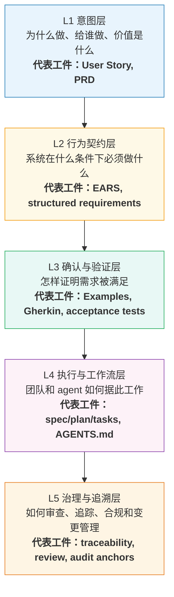
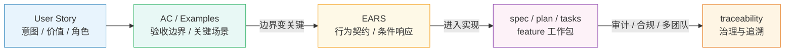
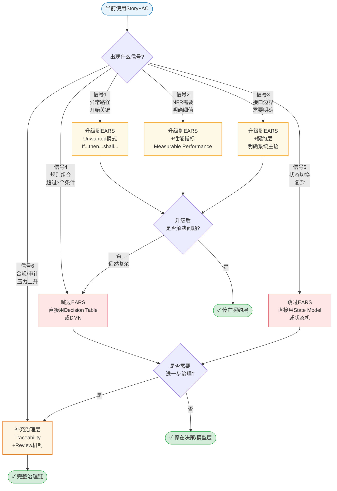
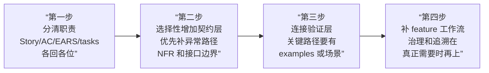

# AI 时代需求工程主指南

**建议阅读阶段：** 初级 → 中级

**第一轮目标：** 建立分层表达的地图，知道不同工件各自负责什么。

**核心要点：**
- `User Story` 是意图层，不是规格。质量锚点是 `INVEST`（详见 `04-user-story-examples.md` 的完整解释和可视化图表）
- `EARS`（Easy Approach to Requirements Syntax，一种受控自然语言需求写法）是契约层，重点看是否 Verifiable、条件是否显式、是否可量化

**第一轮可以暂时跳过：** 复杂决策逻辑、完整 feature workflow、traceability 与治理闭环。

## 📖 本文档与其他文档的关系

**本文重点**：建立整套分层需求表达体系的共享心智模型

**前置阅读**：无，这是入门主文档

**相关文档**：
- PM 迁移指南 → 见 `02-pm-guide.md`
- Story 写作示例 → 见 `04-user-story-examples.md`
- EARS 写作示例 → 见 `05-ears-examples.md`
- 高级规格与架构 → 见 `03-spec-architecture-guide.md`
- 术语查询 → 见 `07-glossary.md`

**可以跳过**：如果你只想快速上手 PM 工作，可以先看 `02-pm-guide.md`，之后再回来看本文建立完整心智模型

## 为什么现在要重新理解需求工程

很多团队并不是真的”不写需求”，而是把不同层次的信息混写在一起：一段 User Story 里塞进技术约束，一组验收标准里埋着决策逻辑，一份 agent 上下文文件（如 `AGENTS.md`、`CLAUDE.md`）里又堆满 feature 细节。人类团队有时还能靠口头补救这种混乱，但 coding agent 会把这种混杂直接放大。输入越混，输出越飘；边界越不清，返工越多。

所以 AI 时代真正改变的，不是“需求文档又回来了”，而是需求表达必须重新分层。以前很多团队还能靠 tacit knowledge（团队多年积累的隐性经验和默契）、固定搭档和口头澄清把问题糊过去。现在同一份输入既要服务工程师、测试、PM，也要服务 agent、工作流和自动化检查，原来那种“差不多能懂”的写法开始越来越不够用了。

这并不意味着每个团队都要立刻走向重型规范。更准确地说，团队需要学会判断：哪些信息应该保持轻量，哪些信息必须升级成更明确、更可验证、更方便执行的表达。

## 一张图看懂五层分层表达体系



**图中颜色编码：** 蓝色=意图层，黄色=契约层，绿色=验证层，紫色=执行层，橙色=治理层。后续所有图表沿用此编码。

这张图展示了五层如何逐步收紧：从上游意图到下游治理，每一层都有自己最擅长的工件。

少了意图层，团队只会实现条款、不知道为什么做。少了契约层，大家对同一句业务语言各自脑补。少了验证层，需求永远停留在”看起来说清了”。少了执行层，写得再好的规格也进不了日常开发循环。少了治理层，团队一旦变大、周期一拉长，文档就会腐烂。

## 几种核心工件分别解决什么问题

| 工件 | 最适合回答的问题 | 它最不该承担的职责 |
| --- | --- | --- |
| `User Story` | 为什么做、给谁做、希望得到什么结果 | 不该伪装成完整规格 |
| `Acceptance Criteria / Examples` | 关键行为、边界和验收条件是什么 | 不该取代上游意图 |
| `EARS` | 系统在特定条件下必须如何响应 | 不该硬扛复杂决策逻辑 |
| `Gherkin / BDD 场景` | 怎样把关键例子变成可验证场景 | 不该充当需求本体 |
| `AGENTS.md` / rules | 团队或仓库级的共享上下文和工作约束 | 不该塞进 feature 细节仓库 |
| `spec / plan / tasks` | 怎样把某个 feature 组织成 agent 和人都能执行的工作包 | 不该替代团队级约束 |
| `traceability / review / governance` | 怎样追踪变化、解释取舍、支持审查和合规 | 不该绑架所有轻量项目都重型化 |

最重要的不是记住术语，而是记住分工。需求工程一旦开始退化，往往不是因为团队“没用对某个模板”，而是因为一份工件承担了太多本不属于它的职责。

如果你是第一次接触这套体系，再额外记住一条就够了：Story 的正式质量锚点不是泛泛的“写得顺不顺”，而是 `INVEST`；EARS 这类契约层写法则更接近 requirement quality，重点看是否 `Verifiable`、是否条件显式、是否可量化。

## 从模糊意图到可执行工作包

同一个需求，会随着风险、复杂度和协作成本增加，被不同层的工件逐步接住。



这条链不是每次都要走满：原型探索期可能停在 Story + AC；平台能力或高风险功能才会自然走到更深的层次。重要的是知道**什么时候该停、什么时候必须升级**。

最上游，你可能先有一条 Story，让团队知道这件事为何值得做。接着，你会用 AC、Examples 或更明确的结构化描述，补上 Story 故意留白的部分。当系统行为边界变得更关键时，你可能会用 EARS 一类受控自然语言，把触发条件、状态和响应写稳。当需求已经足够明确，可以进入实现和交付时，才轮到 `spec / plan / tasks` 一类 feature 工作包组织方式上场。再往后，如果项目有审计、合规、长期维护或多团队依赖压力，治理和追溯机制就必须补上。

## 一个贯穿式例子：手机银行主屏余额

先看最上游的 Story：

```text
As a mobile banking customer,
I want to see my account balance directly on the home screen,
so that I can check my finances at a glance without extra taps.
```

这条 Story 做对了三件事：它把角色写清楚了，把结果写清楚了，也把价值写清楚了。它没有急着写缓存策略、接口时延、未登录遮罩、超时降级，这不是偷懒，而是职责克制。Story 的工作本来就不是把系统行为一次写完。

但如果团队只停在这里，就会马上遇到落地问题：未登录时余额能不能显示？后端超时怎么办？多久刷新一次？这些问题不补，工程和测试很快就会各自脑补。

这时候，AC 或 examples 就该接住 Story 的留白。例如：

```gherkin
Scenario: Balance renders after home screen opens
  Given the user is authenticated
  When the user opens the home screen
  Then the real-time balance is displayed within 1000 ms

Scenario: Timeout triggers fallback
  Given the accounting backend latency exceeds 3000 ms
  When the user opens the home screen
  Then a skeleton placeholder is shown
  And a timeout event is logged with the request ID
```

如果系统行为边界进一步重要，例如你要把条件、响应和异常写得更稳，就可以继续下沉到契约层：

```text
While the user is in an authenticated session, the Mobile Banking App shall render the real-time balance on the home screen within 1 second of screen load.

If the core accounting backend does not respond within 3 seconds, then the Mobile Banking App shall display a skeleton placeholder and log the timeout event with the request ID.

While the user is not authenticated, the Mobile Banking App shall mask the balance field with "****".
```

到这里，团队已经不再只是在讨论“主屏余额这个想法不错”，而是在描述系统在什么条件下必须如何响应。再往下，如果这个 feature 由 agent 和工程师共同实现，你就不该把所有实现细节塞进一个永远加载的 `AGENTS.md`，而应组织成一个 feature 级工作包，例如：

```text
spec:
  Goal: Show the user's balance on the home screen safely and quickly
  Key constraints:
    - authenticated sessions show real-time balance within 1 second
    - unauthenticated sessions mask the balance field
    - backend timeout falls back to skeleton placeholder and logs request ID

plan:
  1. define UI state model
  2. integrate balance fetch and timeout handling
  3. add tests for authenticated, unauthenticated, and timeout paths

tasks:
  - implement home-screen balance widget
  - add timeout telemetry
  - add acceptance tests for latency and masking behavior
```

这就是分层的真正意义。Story 没有失效，它只是停留在最合适的位置。后续层次不是替代它，而是把它无法稳定承载的内容，交给更合适的工件。

## 什么时候该升级到更严格的规格

不是所有需求都值得升级。升级本身也有成本。真正要问的问题是：如果不升级，这个需求最容易在哪些地方失真、分歧或返工？

在真实团队里，升级通常不是从”我们想变得更规范”开始的，而是从几句不断重复出现的话开始的。比如”这条异常到底算不算需求本体””这个性能要求到底写在哪””测试怎么证明这个边界已经满足””这个规则组合是不是还有漏网情况”。当这些问题开始反复出现时，升级表达层往往已经比继续靠口头补救更便宜。

### 升级决策矩阵

用这张图判断你的需求处在哪个阶段，以及是否需要升级：



**关键判断**：
- **黄色节点** = 升级到 EARS 契约层，适合大多数边界明确的场景
- **红色节点** = EARS 不够用，需要更强的建模工具（决策表、状态模型）
- **橙色节点** = 需要补充治理机制（追溯、审查、合规）
- **绿色终点** = 当前层次已足够，不要过度形式化

最重要的原则：**不要为了形式化而形式化**。只在真正需要时升级，升级后如果解决了问题就停下来。

### 常见升级信号速查表

| 触发信号 | 说明 | 建议新增的表达层 |
| --- | --- | --- |
| 规则组合开始变多 | 一句自然语言已经装不下条件组合 | 引入 EARS，必要时再引入 decision table / DMN |
| 非功能约束变关键 | NFR（Non-Functional Requirements，非功能需求）：延迟、吞吐、可靠性、安全性开始影响结果 | 把关键约束写进契约层和验证层 |
| 异常和降级路径重要 | 失败模式本身就是需求的一部分 | 增加异常路径的 EARS 和 examples |
| 多团队协作 | 不同团队靠口头共识已不够 | 增加更明确的工件边界和 traceability |
| 合规或审计压力上升 | 未来需要解释为什么这么做 | 增加治理与追溯层 |
| coding agent 深度参与 | 模糊表达会直接被执行环节放大 | 保持短 team context，并补 feature spec/workflow |

可以把这张表理解为一个判断框架，而不是硬性流程。很多时候，团队并不是一次性”上规格”，而是在某个 feature 上先补异常路径、再补 `INVEST-T` 交接、再补验证和追溯。团队越知道自己为什么升级，就越不容易被格式本身绑架。

## AI coding workflow 为什么会改变需求写法

coding agent 不是一个更快的初级工程师。它没有你所在团队多年来形成的 tacit knowledge，也不会天然知道某个术语在你们项目里到底意味着什么。它对输入非常敏感：边界含糊时，它会主动补；信息冲突时，它会赌一个解释；约束分散在多个地方时，它会漏掉其中一部分。

这就是为什么“一个很长的 `AGENTS.md`”看起来方便，实际上常常有害。团队级上下文文件当然需要，但它们更适合放稳定的团队约束、仓库导航、工作方式和守则。某个 feature 的具体目标、关键行为、异常路径、验收条件和执行任务，应该进入 feature 的 `spec / plan / tasks` 一类工件，而不是堆在 always-loaded 文件里。

从工程角度看，这不是在迎合 agent，而是在提高输入质量。人类团队也同样受益：边界更清楚，讨论更集中，评审更容易，测试更少猜。

## 团队落地的最小可行路径

团队不需要从第一天就上完整的形式化体系。更现实的路径通常是分四步走。



第一步，先分清职责。让 Story 回到意图层，让 AC、Examples、EARS、tasks 各回各位。很多团队只做这一步，质量就会明显上升。

第二步，选择性地增加契约层。优先在异常路径、NFR、接口边界、失败模式明显的地方引入 EARS 或等价的结构化需求写法，而不是把所有功能一夜之间”EARS 化”。

第三步，把关键行为连到验证层。稳定的业务路径和风险路径都要有 examples 或可执行场景，不让需求停留在”已经说过了”的状态。

第四步，当 agent 深度参与、团队规模扩大或治理压力上升时，再补 feature 级工作流和追溯机制。让短 team context、feature spec、plan、tasks、tests 形成一个闭环，而不是把所有信息塞进一个总文件。

这条路径的好处在于，它不会逼团队在轻量项目上过度形式化，但也不会在风险真正上来时继续靠模糊共识硬扛。

## 常见误区

常见误区最麻烦的地方，不在于它们明显错误，而在于它们常常都披着“这样更省事”的外衣。把 Story 写满，看起来像一步到位；把 Gherkin 当主文档，看起来像测试和需求统一了；把 `AGENTS.md` 写得很长，看起来像上下文最全。问题是，这些做法往往只是在上游省了一点点表达工夫，随后把复杂度转嫁给实现、测试和评审。

| 误区 | 问题在哪里 | 更稳的做法 |
| --- | --- | --- |
| 把 Story 当合同 | Story 擅长表达价值，不擅长承载完整边界 | Story 讲 why，边界下沉到 AC/EARS |
| 把 Gherkin 当需求本体 | Gherkin 擅长验证，不擅长承担上游意图和系统契约 | 承接验证层，不替代前两层 |
| 把 EARS 当万能格式 | EARS 一旦开始承载复杂决策网，就会变得笨重 | 复杂规则组合时引入 decision table/DMN |
| 把 `AGENTS.md` 当总需求库 | always-loaded 文件很容易膨胀、过期、互相冲突 | 保持 team context 短小，feature 细节下沉 |
| 把治理理解成重型流程 | 结果是团队要么全部拒绝治理，要么过度文书化 | 只在风险/依赖/审计需求上升时补治理层 |

这些误区的共同点，是总想用一种工件一次解决所有问题。需求工程真正需要的，不是银弹，而是良好的职责分配。你越能接受“不同层解决不同问题”，后面的文档数量和协作成本反而越容易控制。

## 结论

AI 时代并没有让需求工程消失，反而把它的层次暴露得更清楚了。越是有人和 agent 共同工作的环境，越需要把意图、契约、验证、执行和治理拆开处理。

真正有效的团队，不是“终于找到了最强模板”的团队，而是能根据风险和复杂度，把不同信息放进最合适工件里的团队。`User Story`、`EARS`、`Examples / Gherkin`、`AGENTS.md`、`spec / plan / tasks`、traceability 和治理，都有自己的位置。把这些位置放对，比追逐任何单一格式都更重要。
