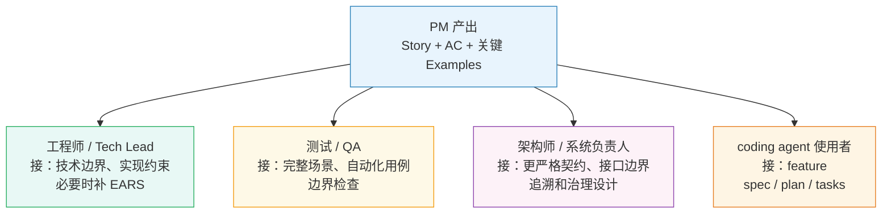
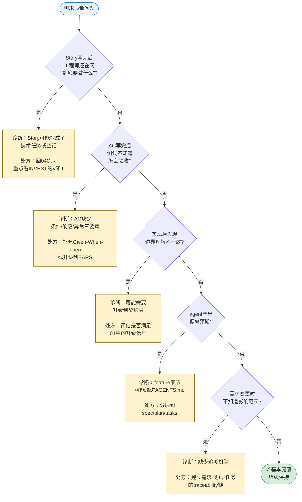
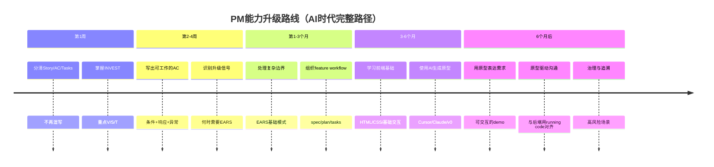

# 给传统 PM 的 AI 时代需求工程迁移指南

**建议阅读阶段：** 初级

**第一轮目标：** 知道 PRD、Story、AC、EARS 的职责边界，以及 PM 第一轮只需要做到哪几步。

**如果你完全不熟悉这些概念：** 可先快速浏览 `01-main-guide.md` 的前三节，或直接查阅 `07-glossary.md`，再回来读本文。

**核心要点：**
- Story 的质量锚点是 `INVEST`（详见 `04-user-story-examples.md` 的完整解释和可视化图表）
- 第一轮先守住 `V = Valuable`、`S = Small`、`T = Testable`，把关键 AC 写到工程和测试能接住的程度

**第一轮可以暂时跳过：** 复杂 EARS 模式、DMN/decision table、traceability/governance。

**本文用的贯穿例子：** "手机银行主屏余额"（Story 到 AC 阶段）+ "大额转账风控"（升级到契约层阶段）。`01-main-guide.md` 也用了手机银行余额这个例子，两者可以对照看。

## 📖 本文档与其他文档的关系

**本文重点**：帮助传统 PM 理解职责边界，快速上手分层需求表达

**前置阅读**：如果你完全不熟悉这些概念，可先快速浏览 `01-main-guide.md` 的前三节

**相关文档**：
- Story 写作的详细示例和练习 → 见 `04-user-story-examples.md`
- EARS 契约层写法 → 见 `05-ears-examples.md`
- 高级规格与治理 → 见 `03-spec-architecture-guide.md`
- 术语查询 → 见 `07-glossary.md`

**可以跳过**：复杂 EARS 模式、DMN/decision table、traceability/governance（这些是高级主题）

## 给传统 PM 的起点

如果你已经习惯写 PRD、User Story、Acceptance Criteria，这套方法并不是来宣布“旧方法作废”的。真正需要更新的，不是你过去做过的工作，而是这些工件之间的职责边界。

过去很多团队默认让一份 PRD 或一条 Story 同时承担愿景、规则、例外、验收、任务提示，甚至技术约束。只要团队小、上下文稳定，这种写法还勉强能运转。AI coding workflow 进来之后，这种混写会更快暴露问题。工程师会补自己的理解，agent 会补另一套理解，最后大家对同一条需求以为自己懂了，实际上各自抓住的不是同一个重点。

所以 PM 在 AI 时代最重要的升级，不是先学会某种新格式，而是先学会把不同类型的信息放回更合适的位置。Story 继续有用，但它要回到最擅长的地方。AC、Examples、EARS 和 feature workflow 也要各自承担本来属于它们的职责。

对 Story 而言，质量锚点是 `INVEST`（Independent, Negotiable, Valuable, Estimable, Small, Testable）。PM 第一轮最值得先守住的是 `Valuable`、`Small` 和 `Testable`。

## PRD、Story、AC 到底各自负责什么

可以先用一句最实用的话来记：

- `PRD` 负责讲业务背景、目标、范围和约束环境。
- `Story` 负责讲角色、结果和价值。
- `AC / Examples` 负责讲关键行为和验收边界。
- `EARS` 负责讲系统在什么条件下必须如何响应。
- `tasks / spec / plan` 负责讲怎样把需求组织成可执行工作包。

把这些工件放回同一条链条里，更容易看清它们为什么不能再互相代打。

| 工件 | PM 最该用它解决什么问题 | 最不该继续让它承担什么 |
| --- | --- | --- |
| `PRD` | 说明业务目标、范围、优先级、约束环境 | 不该替代逐条行为契约 |
| `User Story` | 对齐“谁要什么结果，为什么值得做” | 不该伪装成完整规格 |
| `Acceptance Criteria` | 明确关键条件、输出和验收线 | 不该代替上游业务意图 |
| `Examples` | 用具体场景消除歧义 | 不该单独承担系统契约 |
| `EARS` | 在边界重要时，把系统行为写稳 | 不该被要求承载全部产品上下文 |
| `tasks / plan` | 把已经明确的需求组织成执行工作 | 不该反过来替代需求分析 |

很多 PM 的痛点，其实不是“不会写 Story”，而是 Story 一写就变成半份规格。问题通常从这里开始：想把信息一次写全，于是把本该下沉到 AC、Examples、EARS 甚至 tasks 的内容，一股脑塞进 Story 或 PRD。

## 怎样写出有用的 User Story

User Story 最有价值的时候，不是在写得像合同，而是在把角色、结果和价值压成一句足够清楚、又保留协作空间的表达。

最基础的判断标准还是那几个问题：

- 这条 Story 的角色是不是一个真实的受益方，而不是某个内部技术岗位随手顶上去？
- 它讲的是想要的结果，还是已经开始偷写实现方案？
- 它的价值是不是具体到足以帮助排序，而不是“提升体验”“更方便”这种万能词？

一个常见坏例，是把技术任务伪装成 Story：

```text
As a backend engineer, I want to change the /api/v2/order response code from 200 to 201, so that the frontend can adapt to the new standard.
```

这类写法的问题不在于技术内容不重要，而在于它根本不是用户故事。角色错了，价值不对，协商空间也已经消失。这种内容更适合成为技术任务，或者在确实需要时成为一条 Enabler Story，再把具体接口细节放进 AC 或技术规格里。

另一个常见坏例，是把非功能需求整包硬塞进 Story：

```text
As a user, I want the app to be fast, secure, and reliable, so that I can enjoy using it.
```

这种写法的主要问题不是抽象，而是不可工作。它把多个不同维度的要求压成一句既不可测、也不可分工的愿望。更稳的做法通常有两种：要么把关键指标下沉到 AC，要么在边界足够重要时，直接进入更强的契约表达。

Story 真正该守住的，是上游意图。它应该让工程、设计、测试和 PM 站在同一个目标上，而不是提前把所有细节写死。

如果你在写完一条 Story 后想快速判断它是不是靠谱，一个最稳的心法是：先别问“这句听起来顺不顺”，而是先问它大致有没有守住 `INVEST`。特别是 `T = Testable`，它不要求 Story 自己写完整阈值，但要求别人能看出后面该如何确认它是否成立。

## 怎样写出可工作的 Acceptance Criteria 与 Examples

Story 不负责写完一切，AC 和 Examples 的工作就是接住 Story 故意留白的部分。

这一步对 PM 特别关键，因为很多团队的问题不是完全没有 AC，而是 AC 还停留在口头化的愿望描述，例如“余额应该显示正确”“性能要快一点”“出错时要有提示”。这种写法看似比 Story 更具体，实际上仍然不够让工程和测试稳定对齐。

更稳的 AC 通常要把几个问题讲清：

- 在什么条件下？
- 发生了什么动作或输入？
- 系统应该给出什么结果？
- 异常时怎样降级？

如果你发现 AC 已经开始越来越像具体场景，那其实是个好信号，说明你在从抽象意图走向可确认表达。Examples 的作用，就是把这些边界写得让大家无法各自脑补。

例如，同样是“主屏显示余额”，一句泛泛的 AC 可能是：

```text
用户打开主屏后应看到余额。
```

而更可工作的写法会开始补足状态和结果：

```text
Given the user is authenticated
When the user opens the home screen
Then the real-time balance is displayed within 1000 ms
```

这里最重要的不是格式本身，而是思路变化。这种 Given-When-Then 的写法叫 Gherkin——一种专门用来把验收条件写成可执行场景的结构化语言，属于 BDD（Behavior-Driven Development，行为驱动开发）方法的一部分。PM 不一定要亲自把所有内容写成 Gherkin，但至少要开始习惯把需求写到足以让测试和工程团队知道应该验证什么。

## 什么时候需要 EARS 或更强的规格表达

很多 PM 对 EARS（Easy Approach to Requirements Syntax，一种把系统行为写成结构化条件句的需求写法）的第一反应是”这是不是我要学的新模板”。更实用的理解方式不是”我要不要学会 EARS 全套句法”，而是”什么时候 Story 和 AC 已经不够用了”。

通常有几个明显的升级信号：

| 升级信号 | 说明 | 常见下一步 |
| --- | --- | --- |
| 异常和降级路径开始关键 | 失败模式本身会影响结果 | 把关键异常路径写成更明确的契约 |
| NFR 开始主导结果 | NFR（Non-Functional Requirements，非功能需求）：性能、安全、可靠性已经不是补充信息 | 把关键指标写进 AC 或 EARS |
| 条件和状态变多 | 一句话已经装不下真实边界 | 引入 EARS，必要时再进入 decision table / DMN（Decision Model and Notation，决策模型与标记语言） |
| 接口或系统边界重要 | 工程实现需要更明确的系统响应约束 | 引入更明确的行为契约 |
| 合规和审计压力出现 | 以后需要解释“为什么这样实现” | 增加更可追溯的表达和审查链 |

PM 不需要把所有需求都推进到 EARS。真正成熟的做法，是只在边界重要、歧义代价高的时候升级表达。换句话说，EARS 不该成为 PM 的默认起手式，而应该成为“当轻量表达不足时，用来稳住行为边界”的工具。

换个更正式的说法就是：Story 层先看 `INVEST`，契约层再看 requirement quality，例如 `Verifiable`、`Explicit Conditions`、`Measurable Performance`。这两层不要混成一个判断框架。

## PM 如何与工程师、测试、架构师和 agent 协作

PM 的工作不是把所有工件都亲自写完，而是把需求推进到足以让不同角色各自接力。



这张图展示了 PM 产出如何流向不同角色：每个角色接住 PM 的输出后，会在自己擅长的层次继续深化。

| 协作对象 | PM 最该提供什么 | 对方通常会接什么 |
| --- | --- | --- |
| 工程师 / Tech Lead | 清楚的目标、范围、优先级、关键例外 | 更明确的技术边界、实现约束、必要时的 EARS |
| 测试 / QA | 可验证的 AC、关键 Examples、风险路径 | 更完整的场景、自动化用例、边界检查 |
| 架构师 / 系统负责人 | 为什么做、什么不能错、哪些约束上升 | 更严格的契约、接口边界、追溯和治理设计 |
| coding agent 使用者 | 清楚的 feature 目标和验收条件 | feature `spec / plan / tasks` 与执行闭环 |

这里有一个容易踩的坑：把“要让 agent 能工作”理解成“把所有需求写进 `AGENTS.md`”。这通常会适得其反。team 或 repo 级的上下文文件应该保持短小，主要承载共享约束、工作方式和导航信息。某个功能的具体目标、关键行为、异常路径和验收条件，更适合进入 feature 级的 `spec / plan / tasks` 一类工件。

对 PM 来说，这意味着接口更清楚了。你不需要写一份万能文档，只需要把需求推进到对方可以稳定接住的层次。

## 常见文档反模式

PM 文档最常见的问题，不是”写得不够正式”，而是职责混乱。

| 反模式 | 症状 | 根本问题 | 更稳的做法 |
| --- | --- | --- | --- |
| 空洞 Story | 格式正确，但角色含糊、价值空泛、边界全靠会后口头补 | Story 没有实质内容，只是外壳 | 先守住 `INVEST` 的 `V`（Valuable）和 `T`（Testable） |
| 伪规格 Story | 写的是技术任务或系统约束，却硬套 Story 外壳 | 让人误以为已完成需求分析 | 技术任务归技术任务，不要套 Story 格式 |
| NFR 硬塞进 Story | “fast、secure、reliable” 塞成一句愿望 | 没有指标，没有落点，不可工作 | 关键指标下沉到 AC，边界重要时升级到 EARS |
| 需求堆进 agent 上下文 | feature 细节写进 always-loaded rules 或 `AGENTS.md` | 短期方便，长期膨胀、冲突、过期 | 保持 team context 短小；feature 细节进 `spec / plan / tasks` |
| AC 写成空洞愿望 | “应该正确””应该友好””应该快” | 看似验收条件，实际无法据此验证 | 明确”在什么条件下、给出什么结果算通过” |

这些反模式的共同点是：它们都试图让一层工件越界去承担另一层工件的职责。

## 一个从需求到交付的端到端示范

还是用“手机银行主屏余额”这个例子来看整条迁移链。

先从 Story 开始：

```text
As a mobile banking customer,
I want to see my account balance directly on the home screen,
so that I can check my finances at a glance without extra taps.
```

这一步对 PM 已经足够说明三件事：谁要、要什么、为什么值。它不负责讲完异常、权限、刷新和性能。

接下来，PM 可以补上更可工作的 AC 或 examples——这是**验证层（L3）**的表达，用 Gherkin 格式把关键场景写成可确认的形式：

```gherkin
Scenario: Balance renders within 1 second
  Given the user is authenticated
  When the user opens the home screen
  Then the real-time balance is displayed within 1000 ms

Scenario: Backend timeout triggers fallback
  Given the accounting backend latency exceeds 3000 ms
  When the user opens the home screen
  Then a skeleton placeholder is shown
  And a timeout event is logged with the request ID
```

如果团队发现这些边界已经足够关键，工程或架构侧就可以进一步把核心要求收束成**契约层（L2）**的 EARS 表达——这不是 Gherkin 的替代，而是更上游的行为约束：

```text
While the user is in an authenticated session, the Mobile Banking App shall render the real-time balance on the home screen within 1 second of screen load.

If the core accounting backend does not respond within 3 seconds, then the Mobile Banking App shall display a skeleton placeholder and log the timeout event with the request ID.
```

最后，当这个需求进入具体开发环节时，它不该继续停留在 Story 或 `AGENTS.md` 里，而应该进入 feature 级工作包，例如 `spec / plan / tasks`。对 PM 来说，最重要的不是亲手写完后面每一层，而是知道什么时候该把需求交接给下一层工件和下一类角色。

## PM 的最小方法包

如果只保留最实用的一套方法，PM 在 AI 时代至少应该先做到下面几件事。

第一，继续写 Story，但只让 Story 承担角色、结果和价值，不再让它伪装成完整规格。

第二，给关键需求补真正可工作的 AC 或 examples，至少让工程和测试知道该验证什么。

第三，一旦出现异常路径、NFR、规则组合或接口边界，就主动判断是否需要更强的契约表达，而不是继续把复杂度塞回 Story。

第四，不把 feature 细节堆进 always-loaded 的上下文文件里，而是接受 feature `spec / plan / tasks` 这类工作包组织方式。

第五，把自己的目标从”写完一份万能文档”改成”把需求推进到下一个角色能稳定接住”。

这五步看起来并不花哨，但它们足以让大多数 PM 从传统文档思维，平稳迁移到 AI 时代更有效的分层需求工程。

### PM 常见问题诊断流程

如果你的需求文档总是出问题，用这个流程图找到根本原因：



**使用建议**：每次遇到需求问题时，从上到下检查一遍。黄色节点给出了诊断和处方，帮你快速定位改进方向。

### PM 能力升级时间线

从传统 PM 到 AI 时代需求工程专家，这是一条现实的成长路径：



**关键里程碑**：
- **第1周**：能写出不越界的 Story，能补出可验证的 AC
- **第1个月**：能判断何时需要升级到契约层
- **第3个月**：能独立处理复杂需求的完整表达链
- **第6个月**：能用AI工具生成可交互原型
- **6个月后**：**用原型代替文档与后端沟通**（AI时代PM的理想状态）

### AI 时代 PM 的终极能力：原型驱动需求

在 AI coding 工具（Cursor、Claude Code、v0、Bolt等）的加持下，PM 完全可以做到：

**传统方式**：
```
PM写PRD → 工程师理解 → 前端实现 → 后端对接 → 发现理解偏差 → 返工
```

**AI时代理想方式**：
```
PM用AI生成可交互原型 → 后端看到running code → 直接对齐接口和行为 → 大幅减少理解偏差
```

**为什么原型是更好的需求表达**：
1. **消除歧义**：一个可点击的按钮比"用户点击提交按钮"更清楚
2. **前置验证**：在写后端代码前就能验证交互逻辑
3. **快速迭代**：改原型比改文档+代码更快
4. **共同语言**：running code 是 PM 和工程师都能理解的语言

**PM 需要掌握的技能**：
- 不需要成为专业前端工程师
- 但需要理解基础的 HTML/CSS/JavaScript 概念
- 学会使用 AI 工具（Cursor、Claude、v0）生成和调整原型
- 理解前后端分离架构，知道如何 mock API

**原型与文档的关系**：
- **原型和文档是互补的，不是替代关系**
- **原型负责**：展示交互流程、界面布局、用户体验
- **文档负责**：说明业务规则、异常处理、性能要求、权限控制
- **两者结合才完整**：原型回答"长什么样、怎么操作"，文档回答"怎么算、什么情况下怎么处理"

**实际工作流**：
```
1. 写 Story：说明用户价值和业务目标
2. 用 AI 生成原型：展示交互流程和界面
3. 写 EARS/AC：补充业务规则、异常处理、性能要求、数据校验
4. 与后端对齐：用原型演示交互，用文档说明业务逻辑和API契约
5. 后端开发：基于文档实现业务逻辑和API
6. 前端开发：基于原型实现界面，对接后端API
```

**关键理解**：
- ❌ 错误：用原型替代文档 → 业务规则、异常处理、性能要求无法表达
- ✅ 正确：原型+文档组合 → 原型展示"看得见的"，文档说明"需要算的"

这就是 AI 时代 PM 的终极形态：**用原型展示交互和体验，用文档说明业务逻辑和约束，两者结合形成完整的需求表达**。

读到这里，第一轮其实就可以先停。等你已经能把 Story 和 AC 写到不太会串层，再去看 `04` 练 Story，或者在边界开始变复杂时再进 `05`。
