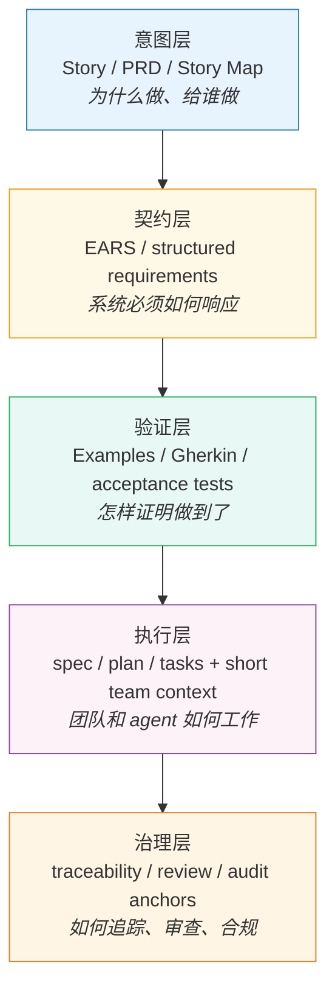
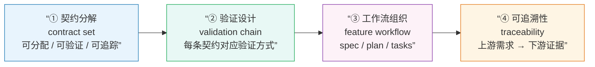

# 规格、架构与工作流深度指南

**建议阅读阶段：** 高级

**进入本文件前，你应该已经理解：**
- Story、AC/Examples、EARS 各自负责什么
- 为什么 feature 细节不该堆进 always-loaded context 文件

**如果你还在解决”Story 怎么别写空””AC 怎么写得可接住”，先去 `04`。** 这份文档不是首轮上手册，而是高级升级指南。

## 📖 本文档与其他文档的关系

**本文重点**：高级场景下的规格分层、验证链、工作流组织和治理机制

**前置阅读**：
- 必须先理解5层体系 → 见 `01-main-guide.md`
- 必须先掌握Story和EARS基础 → 见 `04-user-story-examples.md` 和 `05-ears-examples.md`

**本文深化的内容**：
- 01中的5层体系在高风险场景下如何细化
- 何时需要从EARS升级到Decision Table/State Model
- 如何组织feature workflow避免context bloat
- 如何建立traceability和governance机制

**可以跳过**：如果你的项目还没有遇到多团队协作、合规审查、复杂决策逻辑，本文可以暂时不读

## 为什么高级需求表达一定会进入规格与架构问题

当需求还停留在早期探索期时，团队最需要的是方向、价值和协商空间。可一旦系统开始面对复杂规则、非功能约束、异常路径、多团队依赖、合规审查或 agent-heavy execution，问题就不再只是“需求写得清不清楚”，而是“需求、验证、执行和治理如何组织成一条不会断裂的链”。

这就是为什么高级需求表达最后总会进入规格与架构问题。需求不是一段孤立文本，它会往下长出接口边界、异常处理、性能约束、工作流、测试设计、审查记录和追溯关系。写法一旦升级，本质上就是在决定“哪些信息放在哪一层、由谁承接、如何互相连接”。

对 PM 和架构师来说，最危险的不是格式不够高级，而是把所有复杂性继续压在同一层工件里。Story 一旦开始扛契约、Gherkin 一旦开始扛意图、EARS 一旦开始扛决策网、`AGENTS.md` 一旦开始扛 feature 细节，整条链就会失稳。

## 规格分层总图

这张图是 `01-main-guide.md` 五层体系的深化版本——如果你还没读过 01，建议先回去看那张图的基础版。

**本图与01的区别**：01的图说明"为什么需要分层"，本图说明"每一层在高级场景下如何进一步细化"。



不同层次的工件应该形成一条有方向的链，而不是互相替代。每一层都有自己的职责和最擅长的工件形式。

意图层说明为什么做。契约层说明系统必须如何响应。验证层说明怎样证明它做到了。执行层说明团队和 agent 怎样基于这些工件开展实现。治理层说明当需求变化、系统扩展或审查来临时，这些工件如何保持可追踪、可解释和可维护。

### 模型层的定位

如果你来自系统工程或 MBSE 背景，可能会问：模型层放在哪里？

最稳的回答是：模型层在这条链之上提供另一种更结构化的表达面，但它不替代这条链本身。像 SysML v2（Systems Modeling Language，系统建模语言）这样的 model-layer 锚点，说明”文本规格之外，团队还可以有更正式的模型表达”。但在这份指南里，它只承担定位作用，不承担工具教程或 MBSE（Model-Based Systems Engineering，基于模型的系统工程）教学职责。这里要守住的边界是：承认模型层存在与价值，不把本文扩张成 MBSE 教科书。

## EARS 作为行为契约层的适用边界

EARS（Easy Approach to Requirements Syntax）之所以重要，不是因为它听起来更工程化，而是因为它能把行为边界压到一个对人和流程都更稳定的表达形式里。它的核心思路是：用固定的句型模式，把”在什么条件下，哪个系统，必须做什么”这件事说得明确、可测。

这种清晰度在下面这些场景里特别有价值：

- 异常和降级路径本身很重要
- NFR（Non-Functional Requirements，非功能需求）需要可测落点
- 系统边界和接口责任必须讲清
- 高风险行为需要被 review、验证和追踪

但 EARS 的价值恰恰建立在边界感上。它不是万能格式。一旦你开始往一条句子里塞越来越多前置条件、例外、规则组合和计算逻辑，它就会从“帮助消歧义”变成“把复杂性藏在语法里”。

可以把 EARS 的舒适区理解成三件事：

1. 条件或状态能明确说出
2. 系统主语能明确落到某个模块
3. 响应能被验证

只要这三件事还成立，EARS 往往就值得用。

## 复杂条件、决策逻辑与状态建模

真正的难点通常不是“会不会写 EARS”，而是“什么时候不要再写 EARS”。

当问题已经进入复杂决策逻辑时，更合适的表达对象往往不是受控自然语言，而是 decision table、DMN 或状态模型。因为这时你要表达的核心不再是单个行为契约，而是一张规则网、一组依赖关系，或者一套状态切换。

| 如果问题的核心是 | 更适合的表达 |
| --- | --- |
| 某状态下系统必须如何响应 | `EARS` |
| 异常发生时系统必须怎样降级 | `EARS` |
| 多输入、多规则、可复用 decision logic | `decision table / DMN` |
| 复杂状态切换 | `state model / state machine` |
| 公式、算法、计算逻辑 | `公式 / 伪代码 / 算法规格` |

这不是格式偏好，而是对象边界。DMN 这类标准的定位本来就更接近 business decisions 和 business rules 的精确建模。它适合承载多准则、可复用、可组合的决策逻辑。EARS 则更适合承载系统在具体条件下必须如何响应。

所以，当你发现自己已经在句子里数到四五个前置条件，或者条件组合开始出现真正的规则网时，成熟的做法不是继续修辞，而是换层。

## 从需求到架构约束

需求一旦进入高级阶段，和架构的距离并不远。原因很简单：很多真正重要的需求，本来就不是”页面上多一个按钮”这种孤立变化，而是会往下长出系统边界和实现约束。

| 外溢方向 | 典型问题 | 应进入哪一层表达 |
| --- | --- | --- |
| 接口约束 | 哪个系统对哪个行为负责，超时和失败由谁承接 | 契约层（EARS 或结构化需求） |
| 性能约束 | 延迟、吞吐、恢复时间、资源边界 | 契约层 + 验证层（需有可测阈值）|
| 异常路径 | 故障、降级、超时、备用机制 | 契约层（`If...then...` EARS 模式）|
| 安全与合规 | 权限、脱敏、审计、风险控制 | 契约层 + 治理层 |
| 部署与运行环境 | 在哪些模式、配置或运行状态下生效 | 契约层（`While...` / `Where...` EARS 模式）|

这些都说明一件事：需求工程如果只停留在业务语言，就无法稳定地穿过系统边界。高级需求表达的价值，不是让文档更重，而是让架构层不会靠猜补齐这些约束。

## BDD / Gherkin / Examples 在验证层的正确位置

BDD（Behavior-Driven Development，行为驱动开发）是一种把需求、测试和实现对齐的开发方式，Gherkin 是它配套的场景描述语言，用 Given-When-Then 结构把验收条件写成可执行的测试场景。

验证层最容易被误用。很多团队会把 Gherkin 当成”更正式的需求文档”，或者把 examples 当成”已经足够代替上游分析”。这是顺序错了。

验证层真正的职责，是把已经明确的意图和契约，变成可检查、可运行、可回归的一组场景。它不是 discovery 层，也不是 contract 层。用手机银行主屏余额这个例子来看：

- Story 负责说明为什么这个能力值得做
- EARS 负责说明系统在已登录、超时、未登录等条件下必须如何响应
- Gherkin 则负责说明怎样验证这些要求真的成立

当这三层各司其职时，Gherkin 很强；当它被抬成“统一需求载体”时，反而会失去方向。

更重要的是，验证层不只包含 Gherkin。官方和实践层都在反复说明，requirements / user stories、acceptance criteria、acceptance tests、BPMN（Business Process Model and Notation，业务流程建模标记语言）/ DMN（Decision Model and Notation，决策模型与标记语言）模型、traceability 需要形成治理链。换句话说，验证不是”写几个场景”，而是把需求和测试之间的关系稳定下来。

## Agent 工作流中的规格组织

到了 agent-heavy engineering 环境，规格组织的关键不是“有没有 AGENTS.md”，而是 team/repo context 和 feature artifacts 是否分层。

现在比较稳的趋势非常一致：

- team 或 repo 级文件负责长期共享约束、导航和工作方式
- feature 级文件负责 requirements / design / tasks 或 spec / plan / tasks

像 Kiro 这类 workflow 会把 `requirements / design / tasks` 明确分开，并把 EARS 放在 requirements phase。Spec Kit 这类 workflow 会把 `spec / plan / tasks` 变成显式工件链。OpenSpec 一类框架则把 `proposal / specs / design / tasks` 做成跨工具 workflow。它们的共同点不是文件名相同，而是都在强调一件事：feature 级细节不该塞进 always-loaded 的 team context 文件。

最值得记住的一条实践规则是：

| 层次 | 放什么 | 不放什么 |
| --- | --- | --- |
| team / repo context | 共享守则、代码库导航、长期约束、工作方式 | 某个 feature 的详细边界、异常路径和任务分解 |
| feature workflow | 该功能的需求、设计、计划、任务、检查点 | 团队级长期规范 |

一个最小可工作的 feature workflow 目录结构可以是：

```text
features/
  home-balance/
    requirements.md   # 这个功能的 Story、AC、EARS
    design.md         # 架构决策、接口设计
    tasks.md          # 具体实现任务和检查点
```

team context 文件（如 `AGENTS.md`、`CLAUDE.md`）只放长期稳定约束，不放 `home-balance` 这个功能的具体边界。

这条分层对人类团队也同样有用。它减少的不是文件数量，而是信息漂移。

## Traceability、治理与标准锚点

到了这一层，必须先把一个边界说清：标准很重要，但标准锚点和条文背诵不是一回事。

像 ISO/IEC/IEEE 29148（国际需求工程标准，定义了需求工程的范围、过程和质量属性）这类标准，提供的是 requirements engineering 的官方范围和过程级锚点。它告诉你什么叫 requirement、什么叫好的 requirement 构件、这些活动怎样嵌入生命周期。INCOSE GtWR（Guide to Writing Requirements，INCOSE 需求写作指南）则更接近 practitioner 层的写作和质量规则。两者相关，但不能混用。

在这份指南里，更稳的用法是：

- 把 `29148` 视为 requirements engineering scope 和 lifecycle anchor
- 把 `GtWR` 视为需求质量和写作规则的 practitioner anchor
- 把这些锚点用于解释为什么需要 traceability、review、quality checks
- 不做 clause-by-clause 背诵式断言

对治理来说，最关键的不是把标准名字写进文档，而是让下面这些关系能被看见：

- 上游意图和下游契约之间能否追溯
- 契约和验证场景之间能否对应
- 需求变化时，相关测试、任务和审查是否能找到
- 风险高的要求，是否有更强的 review 和 evidence

真正有效的 traceability 不是为了“看起来很合规”，而是为了在系统变化时还能知道哪些东西会跟着变。

## 深度 worked example：为什么高风险场景必须升级表达

看一个高风险软件场景：在线支付的大额转账风控。

这类场景的特点是：失败代价高（资金损失或合规处罚），涉及多个子系统协作（风控服务、支付网关、审计日志、用户通知），同时有监管合规压力要求可审查。

如果你用 Story 来写它，很容易写成这样：

```text
As a banking customer,
I want large transfers to be checked for fraud,
so that my account is protected from unauthorized transactions.
```

这条 Story 在意图层并不假，但它对真正的系统开发几乎没有指导意义。触发阈值是多少、检测逻辑是什么、误判时怎么办、审计记录如何保存，全都不在里面。

进入契约层后，要求才开始变得可工作：

```text
When a transfer request exceeds 50,000 CNY, the Risk Service shall
complete a fraud-risk assessment within 2 seconds and return a risk
level of LOW, MEDIUM, or HIGH.

If the risk level is HIGH, then the Payment Gateway shall reject the
transfer and log the rejection with the request ID, timestamp, and
risk score.

If the risk level is MEDIUM, then the Payment Gateway shall require
step-up verification before proceeding, and the Notification Service
shall send an in-app alert to the account holder within 10 seconds.
```

这时你会发现几个关键变化。

第一，阈值和响应变得可测——50,000 CNY 的触发线、2 秒的评估时限、10 秒的通知时限，都可以被测试用例直接覆盖。

第二，系统主语和责任边界变得可见——Risk Service、Payment Gateway、Notification Service 各自负责什么，不再靠口头约定。

第三，失效和降级路径不再只是备注，而成为需求本体的一部分——HIGH 和 MEDIUM 两种情况分别有不同的系统响应。

但如果深度示例停在这里，这还只是”把 Story 补成了几条更像样的 requirement”。真正的高风险工作并不会在句子写完时结束。接下来至少还要把四件事补齐：



这四步说明了为什么高风险需求”写出来”只是起点——真正有效的规格必须形成一条从契约到治理的完整链条。

### 1. 先把高层契约拆成一个可工作的 contract set

对大额转账风控这类功能，真正可执行的规格通常不会只有几条句子，而会形成一组相互配合的 contract set。例如：

```text
R-PAY-001
When a transfer request exceeds 50,000 CNY, the Risk Service shall
complete a fraud-risk assessment within 2 seconds and return a risk
level of LOW, MEDIUM, or HIGH.

R-PAY-002
If the risk level is HIGH, then the Payment Gateway shall reject the
transfer and log the rejection with the request ID, timestamp, and
risk score to the Audit Service.

R-PAY-003
If the risk level is MEDIUM, then the Payment Gateway shall pause the
transfer and the Notification Service shall send a step-up verification
request to the account holder within 10 seconds.

R-PAY-004
If the Risk Service does not respond within 3 seconds, then the Payment
Gateway shall reject the transfer and log a RISK_SERVICE_TIMEOUT event
with the request ID.
```

这一步的重要性在于把”一个大能力”拆成多个可分配、可验证、可追踪的 contract unit。否则后面无论是测试、架构分工还是合规评审，都会围着一条过大的句子打转。

### 2. 然后把 contract 接到 validation chain

高风险规格真正需要的，不只是”写得像 requirement”，而是你能说明如何证明这些 requirement 成立。以 `R-PAY-001` 到 `R-PAY-004` 为例，验证链至少会长成下面这样：

| contract | 主要验证方式 | 要看的核心证据 |
| --- | --- | --- |
| `R-PAY-001` | 集成测试 + 性能测试 | Risk Service 响应时间（P95 ≤ 2s）、风险等级枚举覆盖 |
| `R-PAY-002` | 集成测试 + 审计日志验证 | HIGH 场景下拒绝记录是否完整（request ID、timestamp、risk score）|
| `R-PAY-003` | E2E 测试 + 通知延迟测试 | 转账暂停状态、步验请求发出时间（≤ 10s）|
| `R-PAY-004` | 故障注入测试 | Risk Service 超时时的拒绝行为和 RISK_SERVICE_TIMEOUT 日志 |

这张表看起来像测试设计，其实是在补一个更深的事实：高风险 requirement 的 Verifiable / Measurable 不能只停在 requirement 句子里，而要继续落到”什么证据算通过”。如果 requirement 没有证据面，评审时就很难知道它是否真能被验证；如果验证链没连到具体 contract，测试又会失去需求锚点。

为了让这个连接更清楚，还可以把其中一条 requirement 继续写成 compact validation example：

```gherkin
Scenario: High-risk transfer is rejected and logged
  Given a transfer request for 80,000 CNY is submitted
  And the Risk Service returns risk level HIGH within 2 seconds
  When the Payment Gateway processes the assessment result
  Then the transfer is rejected
  And the Audit Service receives a rejection record with request ID, timestamp, and risk score
```

这时 Gherkin 的角色就很明确了：它不是 requirement 本体，而是 validation surface。

### 3. 再把它组织成 feature workflow，而不是散落在大文件里

真正要进入 agent 和多角色协作时，这组 contract 和 validation 还必须被组织成一个 feature 工作包：

```text
spec:
  feature: Large Transfer Fraud Risk Control
  goal: block or gate high-risk transfers while maintaining audit trail
  contracts:
    - R-PAY-001 risk assessment trigger and latency
    - R-PAY-002 HIGH risk rejection and audit logging
    - R-PAY-003 MEDIUM risk step-up verification flow
    - R-PAY-004 Risk Service timeout fallback

plan:
  1. define risk level enum and assessment API contract
  2. implement gateway routing logic for HIGH / MEDIUM / LOW
  3. wire Notification Service for step-up verification
  4. add Audit Service integration for rejection and timeout events
  5. build integration and fault-injection test suite

tasks:
  - risk-service: expose assessment endpoint with latency SLA
  - payment-gateway: implement routing by risk level
  - notification-service: step-up verification request within 10s
  - audit-service: rejection and timeout event ingestion
  - verification: add HIGH/MEDIUM/timeout/LOW scenario coverage
```

这一步展示的是执行层为什么不能缺位。没有 feature workflow，requirement 再清楚也很难稳定落到不同模块、不同验证活动和不同责任人身上。

### 4. 最后把 traceability 和 governance 明确到可审查的程度

高风险场景真正和普通业务功能拉开差距的地方，往往不是 requirement 写法本身，而是你是否需要解释：

- 这条 requirement 来自哪个上游业务目标或合规要求
- 哪个子系统负责满足它
- 用什么验证活动证明它
- 变更它时，哪些测试、审查和下游任务必须一起变

一个最小可工作的 traceability slice 可能长这样：

| 上游需求 / 合规锚点 | contract | 验证方式 | 执行工件 | 治理证据 |
| --- | --- | --- | --- | --- |
| 反洗钱合规：大额交易须实时风险评估 | `R-PAY-001` | 集成测试 + 性能测试 | risk-service 实现任务集 | 测试报告 + 合规评审记录 |
| 资金安全：高风险转账须被阻止并留存可查记录 | `R-PAY-002` | 审计日志验证 | payment-gateway + audit-service 任务 | 日志完整性检查记录 |
| 服务可用性：第三方服务异常不得导致资金误放行 | `R-PAY-004` | 故障注入测试 | timeout fallback 实现 + 告警配置 | 故障演练记录 + 超时告警验证 |

这张表想说明的不是”所有项目都要上完整 trace matrix”，而是高风险需求如果没有这类链路，后面就很难回答三个现实问题：这条 requirement 为什么存在，它是怎么被证明的，它改动时谁会被影响。

到这里，你才能真正看出为什么高风险场景会自然把团队推向更深规格表达。不是因为大家喜欢更厚的文档，而是因为 contract、validation、workflow 和 governance 缺一块，整条链就会出现解释断裂。

## 高级反模式与失败模式

### 1. Clause overload

一句 requirement 里塞进越来越多的条件、例外和结果，最后看起来“信息很全”，实际上谁都难以稳定理解。

### 2. 把 decision logic 混进 EARS

一旦 EARS 开始承担规则网，它就不再是契约句，而变成了不透明的逻辑压缩包。

### 3. 把 Gherkin 抬成需求本体

结果是上游意图和系统契约都消失，团队只剩一堆场景脚本。

### 4. Context bloat

把 feature 细节、实现偏好、规则补丁、流程说明全堆进 `AGENTS.md` 或类似 always-loaded 文件，最后谁都不敢信它还是不是最新的。

### 5. Traceability 只挂名不落地

文档里写了“可追溯”，但需求变更时没有人知道哪些测试、哪些任务、哪些审查项需要一起变。

这些失败模式背后其实是同一个问题：层次分工被打乱了。

## 结论与升级路线

规格、架构、验证、工作流和治理并不是需求工程之外的额外负担，它们只是需求在高复杂度环境下必然会触到的不同表面。

最现实的升级路线通常不是一次性形式化，而是分层推进：

1. 先让意图层和契约层分开
2. 再让契约层和验证层连起来
3. 再把 feature workflow 和短 team context 分层
4. 最后在真正需要时补 traceability 和治理锚点

高级需求表达的目标，不是制造更厚的文档，而是让复杂系统里的重要信息各有其位。只要这个目标守住了，Story、EARS、Examples、decision tables、feature specs、traceability 和标准锚点就不再是彼此竞争的格式，而是一条可以协作的链。
