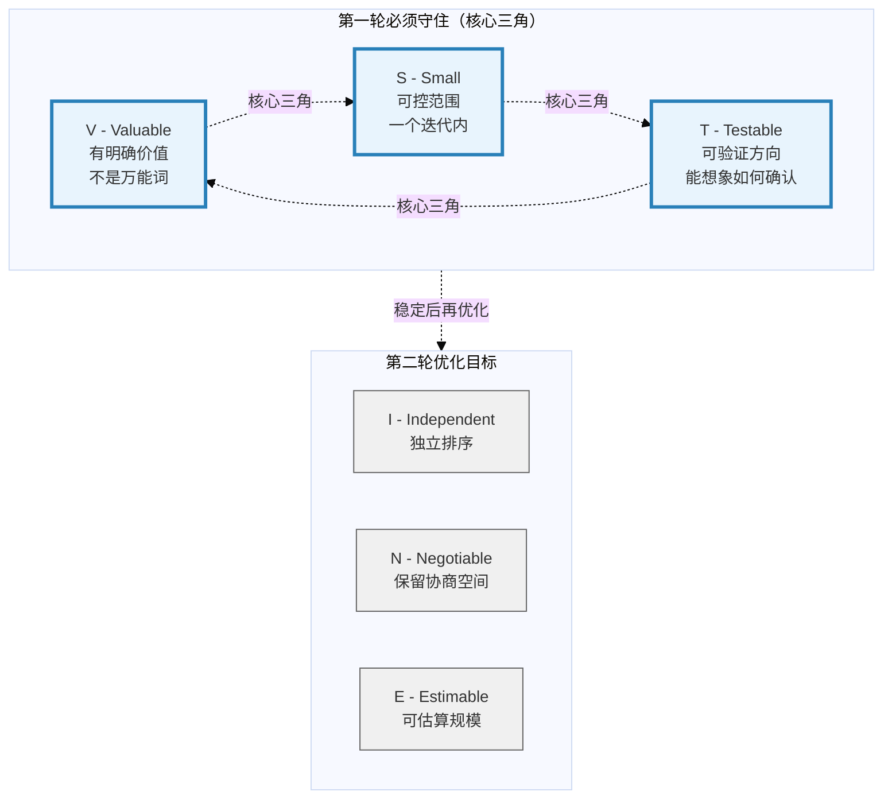
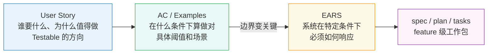
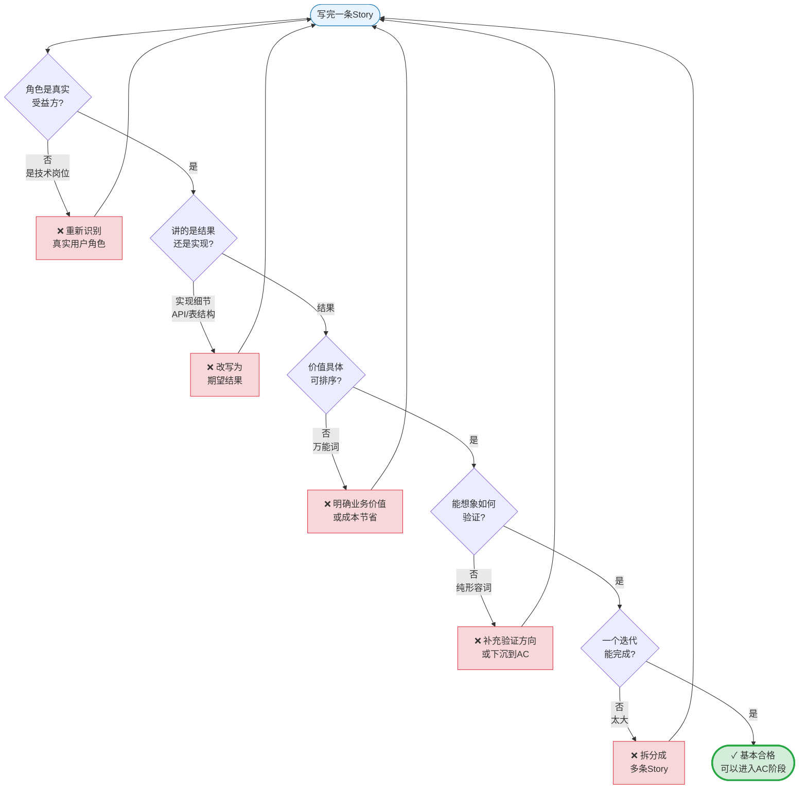

# User Story 示例手册

**建议阅读阶段：** 初级 → 中级

**这份手册的用途：** 通过正例、反例、重构和自检，快速形成”什么样的 Story 算写对了”的手感。

**核心要点：**
- User Story 负责意图层，最擅长表达谁想要什么结果、为什么值得做
- 质量锚点是 `INVEST`，第一轮先守住 `V = Valuable`、`S = Small`、`T = Testable`
- Story 与 AC/Examples 的分界要守住

**第一轮可以暂时跳过：** 平台级、高风险或探索型边界案例。

## 📖 本文档与其他文档的关系

**本文重点**：通过大量示例和练习，掌握 User Story 的写作技巧

**前置阅读**：
- 如果不了解Story在整体中的位置 → 先看 `01-main-guide.md` 或 `02-pm-guide.md`

**本文是权威定义**：
- INVEST框架的完整解释和可视化（其他文档会引用本文）
- Story质量自检流程图

**相关文档**：
- EARS契约层写法 → 见 `05-ears-examples.md`
- 快速参考卡片 → 见 `08-quick-reference.md`
- 术语查询 → 见 `07-glossary.md`

## User Story 的质量标准：INVEST

对 User Story 来说，业界公认的质量框架是 Bill Wake 提出的 `INVEST`，后被 Fowler 与 Mike Cohn 持续引用。

| 字母 | 正式叫法 | 在实务里最值得怎么理解 |
| --- | --- | --- |
| `I` | `Independent` | 不要把多个可独立排序的目标硬揉成一条 |
| `N` | `Negotiable` | 保留对话空间，不要把 Story 写成半份规格 |
| `V` | `Valuable` | 让用户、业务方或明确受益对象真的能从中得到价值 |
| `E` | `Estimable` | 让团队至少能大致判断规模、风险与优先级 |
| `S` | `Small` | 控制到一个迭代内可讨论、可推进 |
| `T` | `Testable` | 让团队能够想象后续如何确认它是否成立 |

这份手册后面会频繁从"是否可测"的角度点评例子。这里的"可测性"是帮你快速判断 `T = Testable` 是否成立的实用视角，不是一个独立的质量框架。Story 的完整质量框架是 `INVEST`——可测性只是其中 T 这一项的落地方式。更稳的理解是：Story 先把 `T = Testable` 的方向说清，后续 AC、Examples 或 EARS 再把"具体怎么测、测到什么程度算通过"说清楚。

### INVEST 质量优先级可视化

初学者常常不知道该先关注哪几项。下面这张图展示了第一轮最该守住的核心三角：



**使用建议**：初学者先集中精力把 V、S、T 做对。等这三项稳定后，再追求 I、N、E 的优化。不要试图第一次就把六项全做完美。

## 先给一套最小判断尺子

写完一条 Story，先别急着自我感觉良好，先过这张表。

| 检查点 | 过关时是什么样 | 常见失败信号 |
| --- | --- | --- |
| `V = Valuable` | 角色和价值都真实，不是万能词堆砌 | “用户”“更方便”“体验更好”但没有具体受益 |
| `N = Negotiable` | 留下协作空间，没有提前写死实现 | 已经开始写 API、表结构、按钮颜色 |
| `E = Estimable` | 团队至少能看出这件事大概在解决什么、规模多大 | 读完后仍然不知道该怎么估、怎么排 |
| `S = Small` | 一次迭代能讨论并推进 | 一条 Story 包了三四个目标 |
| `T = Testable` | 虽然不一定直接写阈值，但别人能看出后面该怎么确认 | 只有“更快”“更好”“更安全”这类形容词，看不出确认路径 |
| 角色与结果是否清楚 | 是真实受益方，讲的是想得到的结果 | 角色虚化，或已经退化成技术任务 |

这张表不用拿来给 Story 打分，它更像一个写完就扫一遍的快速雷达。你扫得越早，越能避免后面把问题带进 AC、开发和测试。

这里要特别补一句：Story 的 `T = Testable`，往往不是直接把 `500 ms`、`P95`、`99.9%` 写进句子，而是把“未来该围绕什么结果确认它成立”说清楚。一个成熟的 Story 应该能把这个确认接口顺利交给 AC、examples 或 EARS，而不是让下游重新猜。

反过来也有一个常见误判：有些句子看起来“很好测”，但测的是接口字段、返回码或实现动作。这种句子可能满足某种技术验证，却仍然不是好 Story，因为它写错了层，也没有真正满足 Story 的 `INVEST` 目标。

## 先看几个正例

### 正例 A：手机银行主屏余额

```text
As a mobile banking customer,
I want to see my account balance directly on the home screen,
so that I can check my finances at a glance without extra taps.
```

这条 Story 的好处在于克制。角色清楚，结果清楚，价值也清楚。它故意没有写缓存策略、接口超时、未登录遮罩和多账户逻辑，因为那些不是 Story 本体该完成的工作。

从 `INVEST` 的 `T = Testable` 来看，它也很稳。虽然句子里没有直接写毫秒数，但”余额是否直接出现在主页”和”是否还需要额外点击”都能自然落成可确认边界。也就是说，它没有自己承载完整阈值，却给后续 AC / Examples 留出了非常干净的确认接口。

### 边界正例 B：回访用户快速进入主页

**什么是”边界正例”？** 指那些刚好踩在合格线上的 Story——它本身不算错，但如果后续没有 AC 或 Examples 补位，就会退化成空话。这类例子帮你理解”Story 可以留白到什么程度”。

```text
As a returning user,
I want the home screen to load quickly,
so that I can start using the app without waiting.
```

这条 Story 不是”写完就够”的优等生，而是一条边界上可接受的 Story。它没有把”快”讲成已经完成的性能规格，而是把”快速进入主页”作为用户结果表达出来。真正的延迟阈值，应该下沉到 AC 或更强的契约层。

从 `T = Testable` 来看，它之所以只是边界正例，是因为 `quickly` 本身还不是确认标准。只有当团队马上补上例如“在 4G 条件下主页 `P95` 可交互时间不超过 `1.5` 秒”这样的 AC 或契约时，这条 Story 才是健康输入。如果没有下游补位，它会很快退化成空话。

### 正例 C：平台能力型 Enabler Story

```text
As the API Platform team,
we need the Order API v2 to emit standardized identity headers,
so that downstream SDK consumers can integrate without per-endpoint workarounds.
```

这类 Story 不是最终用户故事，但在平台型或内部产品场景里是合理的。关键不在于它是不是“人类用户”，而在于它有没有明确的受益对象、结果和价值。

从 `INVEST` 的角度看，这条 Story 的优点是 `V` 和 `T` 都很清楚，但仍然停在正确层次。下游可以继续把它展开为“哪些 header 必须出现、格式是什么、兼容矩阵如何验证”，但 Story 本身不需要把字段表和协议细节提前写死。

## 典型坏例

### 坏例 A：故事写成伪规格

```text
As a backend engineer, I want to change the /api/v2/order response code from 200 to 201, so that the frontend can adapt to the new standard.
```

问题有三个。

第一，角色错位。后端工程师不是这件事的业务受益方。

第二，它说的不是业务结果，而是实现细节。

第三，整条 Story 已经没有协商空间。它看上去像 Story，实际上已经是任务清单。

从 `INVEST` 的 `T = Testable` 来看，这条句子甚至是“可确认但写错层”的反例。`200 -> 201` 当然很好测，但它测的是技术指令，不是用户或业务结果。它提醒我们：有技术验证，不等于 Story 就写对了。

### 坏例 B：NFR 硬塞进 Story

```text
As a user, I want the app to be fast, secure, and reliable, so that I can enjoy using it.
```

这类写法最大的问题不是“空”，而是根本不可工作。三个维度混在一起，没有任何可测边界，也没有清楚到能指导优先级和后续分工。

从 `T = Testable` 来看，它失败得很彻底。`fast`、`secure`、`reliable` 分别需要不同确认体系，但句子没有告诉你到底优先确认什么、在什么场景确认、确认到什么算通过。

### 坏例 C：角色和价值都太虚

```text
As a user, I want better search, so that I can have a better experience.
```

这里几乎每个词都可以更具体。什么用户？什么叫 `better search`？什么叫 `better experience`？这类 Story 最危险的地方在于它看起来像一句完整的话，但不同人读出来的需求完全不是一回事。

从 `T = Testable` 来看，它的问题是根本找不到确认 hook。你没法稳当地定义是看召回率、排序相关性、筛选完成时间、零结果率，还是转化率，因为句子没有把改进方向钉住。

### 坏例 D：一条 Story 里装了多个目标

```text
As a shopper, I want to search products, compare prices, save items, and share carts, so that I can shop more efficiently.
```

这已经不是一条 Story，而是一组能力清单。它会让估算、验收和优先级排序都变得混乱。

从 `INVEST` 的 `S` 与 `T` 来看，它的问题是一条 Story 对应了四条完全不同的确认路径。搜索看检索效率，对比看决策效率，收藏看回访行为，分享看协作传播。把它们揉在一起，只会让后续 AC 和测试失焦。

## 坏例到好例的重构对照

### 重构 1：把伪规格 Story 拉回正确层次

坏例：

```text
As a backend engineer, I want to change the /api/v2/order response code from 200 to 201, so that the frontend can adapt to the new standard.
```

第一种重构方式，是承认它根本不是 Story，把它放回任务层。

第二种重构方式，是把它改成一个平台型 Enabler Story：

```text
As the API Platform team,
we need the Order API v2 to emit REST-compliant status codes and standardized identity headers,
so that future SDK consumers can integrate without per-endpoint workarounds.
```

这里真正的变化不是句子更顺了，而是这条需求终于重新有了清楚的受益对象和结果。具体返回码、字段位置和兼容细节，应该继续下沉到 AC 或技术规格。

从 `INVEST` 的 `V` 与 `T` 来看，重构后的句子把确认方向从“检查某个实现细节是否被执行”拉回到“下游集成是否可以稳定依赖这项能力”。这才是 Story 该提供的确认方向。

### 重构 2：把 NFR 从万能愿望改成可工作的输入

坏例：

```text
As a user, I want the app to be fast, secure, and reliable, so that I can enjoy using it.
```

更稳的重构方式通常有两条路。

如果目标仍然是保留 Story 外壳，可以先只保留最靠近用户结果的那一层：

```text
As a returning user,
I want the home screen to load quickly,
so that I can start using the app without waiting.
```

然后把真正的指标下沉到 AC：

```text
Given 4G network conditions
When the returning user launches the app
Then the home screen is interactive within 1.5 seconds at P95
```

如果性能约束已经是这件事的核心，就不该继续在 Story 层硬扛，而应该升级到更强的契约写法。

这里正好体现 Story 与 `INVEST-T` 的分工：Story 负责把“用户在等什么结果”说清，AC 负责把“多快算通过、在什么样本条件下测”说清。

### 重构 3：把空洞 Story 压实

坏例：

```text
As a user, I want better search, so that I can have a better experience.
```

一种更稳的改法是先把角色、结果和价值收紧：

```text
As a returning marketplace buyer,
I want search results to prioritize in-stock items from nearby sellers,
so that I can find products I can actually buy and receive quickly.
```

这条 Story 仍然没有说明排序算法和权重，但它终于让团队知道这条需求到底在解决什么。

从 `T = Testable` 来看，这条重构把“better”拆成了几个可以继续确认的方向：在库率、邻近卖家优先级、从搜索到下单的路径效率。算法怎么做仍然留给后续层，但确认 hook 已经被明确出来了。

### 重构 4：把一条“大包 Story”拆开

坏例：

```text
As a shopper, I want to search products, compare prices, save items, and share carts, so that I can shop more efficiently.
```

更稳的做法是拆成几条可独立讨论和验收的 Story：

```text
As a shopper, I want to search products by keyword and filter, so that I can narrow down relevant items quickly.

As a shopper, I want to compare shortlisted products side by side, so that I can decide which one fits my needs.

As a shopper, I want to save items for later, so that I can return to them without starting over.
```

拆分之后，优先级、估算和后续 AC 都会自然清楚很多。

从 `INVEST` 的 `S` 与 `T` 来看，拆分最大的好处不是句子更短，而是每条 Story 终于只对应一条主要确认路径。这样团队才能分别定义搜索效率、对比决策效率、收藏回访率等不同验证方式。

## Story 与 AC / Examples 的分界

这是最容易写串的地方。



这张图展示了 Story 如何交接给下游：Story 负责意图和方向，AC/Examples 负责验收边界，EARS 在边界关键时补强契约，最后进入可执行工作包。

| 如果信息在回答什么 | 更适合放在哪里 |
| --- | --- |
| 谁要什么、为什么值得做 | `Story` |
| 什么结果值得被确认、应该沿着哪个方向设计 `Testable` | `Story` |
| 在什么条件下系统算做对了 | `AC / Examples` |
| 异常时怎么降级 | `AC`，边界重要时升级到 `EARS` |
| `Testable` 的具体阈值、统计口径和证据格式 | `AC`、`Examples` 或更强契约 |
| 复杂条件组合和规则网 | 超出 Story；通常进入 `EARS`、decision table 或更强规格层 |
| 具体实现任务 | `tasks / plan / technical spec` |

用“主屏余额”这个例子来看，Story 可以停在：

```text
As a mobile banking customer,
I want to see my account balance directly on the home screen,
so that I can check my finances at a glance without extra taps.
```

而这些内容就不该继续写在 Story 里：

- 未登录时余额是否遮罩
- 后端超时如何降级
- 多少毫秒内显示出来
- 是否记录超时 telemetry

这些已经属于 AC、examples 或契约层。

一句话记住：Story 负责把 `INVEST`，尤其是 `T = Testable` 的方向说清，AC / Examples / EARS 负责把“怎么确认、确认到多少算通过”说清。

## 怎么快速自检

如果没有时间详细 review，可以用下面这张轻量 checklist 快速扫一遍。

| # | 检查动作 | 如果发现这个问题，说明… |
| --- | --- | --- |
| 1 | 把 Story 里的技术细节全部圈出来 | 圈出来太多 → Story 大概率越界了 |
| 2 | 单独读 `so that` 后面那部分 | 价值仍然很空 → 很难排优先级 |
| 3 | 试着说出至少一个 AC 或 EARS 里的确认方式 | 完全说不出来 → `T = Testable` 还太弱 |
| 4 | 看确认方式是否只涉及接口字段、返回码、表结构或组件实现 | 只有这些 → Story 大概率写成了实现指令 |
| 5 | 判断能否在一个迭代里讨论清楚并推进 | 明显太大 → 该拆分 |
| 6 | 试着说出这条 Story 会交接给哪些下游工件（AC、Examples、EARS、tasks） | 说不出来 → Story 可能太抽象或太具体，没有留出清晰的下游接口 |

这套检查不需要 formal score，只要能快速帮你判断”这条 Story 现在是可用，还是只是看起来像可用”。

### Story 质量诊断流程图

如果你不确定一条 Story 是否合格，按这个流程走一遍：



**使用方法**：每次写完 Story 后，从上到下检查一遍。遇到红色节点就停下来修复，直到走到绿色终点。这个流程图对应 INVEST 的核心三角（V、S、T）。

## 怎么验写得是否足够好

验 Story 不是看它像不像模板，而是看它能不能把协作推到下一步。

可以从四个角度看。

第一，协作角度。工程、设计、测试和 PM 读完后，是否对目标形成了大致一致的理解？

第二，`T = Testable` 交接角度。它是否让团队清楚知道后面该围绕什么结果去定义阈值、例子和验证？

第三，实现输入角度。它是否给出了足够稳定的上游意图，让 AC、Examples 和后续规格有明确落点？

第四，粒度角度。它是否还是一条能被排优先级、被拆任务、被单独推进的 backlog 项？

如果四项里有两项都很弱，这条 Story 往往就还不够好。

## 按场景分类的样例库

下面这组样例分类，不是为了追求“分类学完备”，而是帮助你在不同场景下快速知道 Story 最容易写偏到哪里。每一组都刻意补上 `INVEST`，尤其是 `T = Testable` 的点评，因为这正是很多团队最容易漏掉的判断维度。

### 1. 产品功能类

正例：

```text
As a marketplace buyer,
I want to see whether an item is in stock before opening the detail page,
so that I can avoid wasting time on unavailable products.
```

从 `T = Testable` 来看，这条 Story 很好，因为它已经把后续要确认的结果接口讲清楚了。下游可以继续定义“列表页库存标记是否出现”“用户是否还需要额外进入详情页才知道缺货”“缺货点击浪费率是否下降”。

反例：

```text
As a user,
I want cleaner product cards,
so that browsing feels nicer.
```

从 `T = Testable` 来看，这条 Story 的问题不是一定做不出好设计，而是你不知道该确认什么。是信息密度、可扫描性、点击率、首屏完成率，还是纯视觉偏好？句子没有给出稳定方向。

### 2. 平台 / API 类

正例：

```text
As the API Platform team,
we need the Order API v2 to emit standardized identity headers,
so that downstream SDK consumers can integrate without per-endpoint workarounds.
```

从 `INVEST` 来看，这条 Story 很成熟，因为它明确了 `T = Testable` 的落点会在“标准化头字段是否一致、SDK 集成是否不再需要逐接口适配”上，而不是把 header 细节抢先塞回 Story 本体。

反例：

```text
As a backend engineer,
I want to change the /api/v2/order response code from 200 to 201,
so that the frontend can adapt to the new standard.
```

从 `T = Testable` 来看，这条反例很有迷惑性，因为它其实很好测。但它测的是技术动作，不是业务或平台能力结果，所以它更像任务或技术变更项，而不是 Story。

### 3. 异常 / 风险控制类

正例：

```text
As a cardholder,
I want suspicious wire transfers to require step-up verification,
so that unauthorized transfers can be stopped before money leaves my account.
```

从 `T = Testable` 来看，这条 Story 的强项在于它定义了明确的风险结果接口。后续可以继续写哪些转账命中可疑条件、何时触发二次验证、未通过时如何阻断资金流出，但 Story 本身先把“为什么确认、确认什么风险结果”钉住了。

反例：

```text
As a user,
I want risky behavior to be handled automatically,
so that everything is safer.
```

从 `T = Testable` 来看，这条反例的问题是“risky” 没定义，“handled” 没定义，“safer” 也没定义。没有明确风险对象和结果边界，下游只能重新发明需求。

### 4. NFR 主导类

边界正例：

```text
As a returning user,
I want the home screen to load quickly,
so that I can start using the app without waiting.
```

从 `T = Testable` 来看，这条 Story 可以接受，但前提是团队知道它只是确认方向的上游入口，不是确认标准本身。后面必须马上补上响应时间、样本条件、统计口径和失败场景。

反例：

```text
As a user,
I want the app to be fast, secure, and reliable,
so that I can enjoy using it.
```

从 `T = Testable` 来看，这条反例把三套确认体系硬塞成一条句子，最后每一套都讲不清楚。

### 5. 探索型需求

正例：

```text
As a merchant onboarding manager,
I want to trial assisted document review for first-time international sellers,
so that we can learn whether onboarding back-and-forth can be reduced before committing to full automation.
```

从 `T = Testable` 来看，这条 Story 的优点是它既保留了探索空间，也保留了确认方向。下游可以继续看补件轮次、人工往返次数、审核周期是否下降，而不必在 Story 层就把最终方案写成合同。

反例：

```text
As a user,
I want an AI-first onboarding experience,
so that the product feels futuristic.
```

从 `T = Testable` 来看，这条反例没有稳定的验证方向。你很难说“futuristic” 到底对应哪类行为改进、业务结果或体验指标。

## 结尾

学会写 Story，真正难的不是套模板，而是知道哪里该停。

一条好的 Story 不会试图一次写完所有真相。它会把上游意图压到足够清楚，让后续 AC、Examples、EARS 和任务分解都能顺着接下去。真正成熟的写法，不是把数字全塞进 Story，而是先把 `INVEST` 守住，尤其把 `T = Testable` 负责到“方向清楚、交接顺滑”为止。先把 Story 写对，再追求覆盖更多场景，远比把每条 Story 都写得很满更重要。
