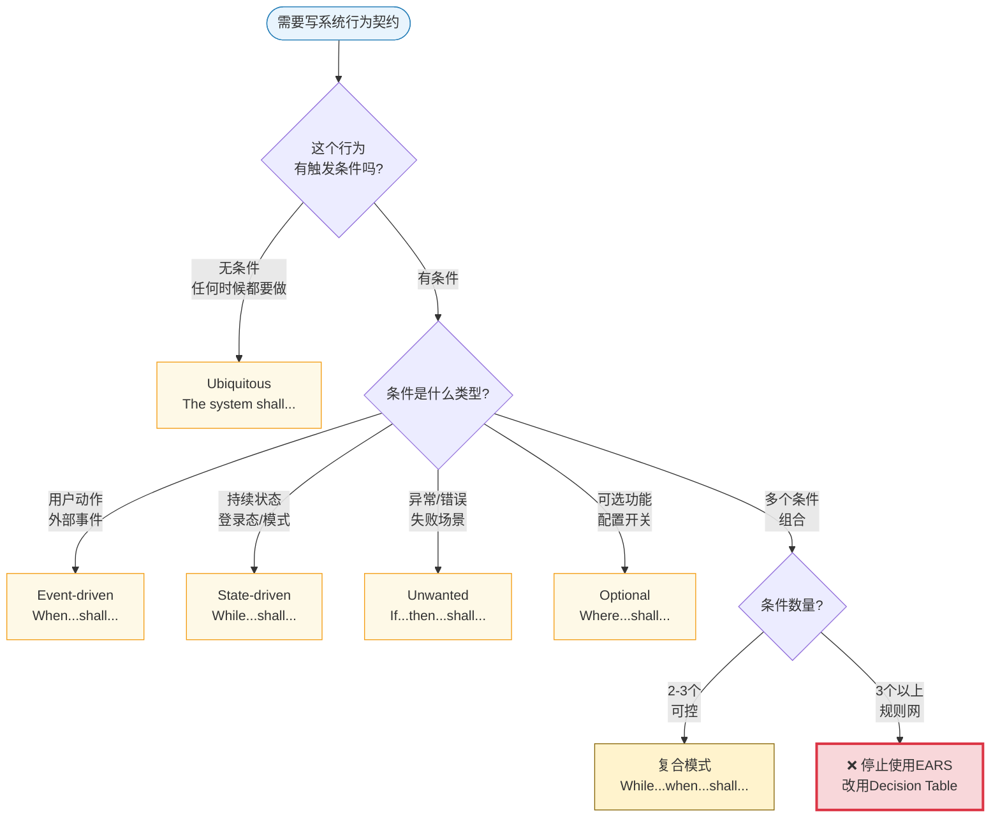

# EARS 示例手册

**建议阅读阶段：** 中级 → 高级

**这份手册的用途：** 通过模式、反例、重构和退出判据，形成”怎样写出稳的 EARS，什么时候又该停下来”的手感。

**核心要点：**
- EARS 负责行为契约层，最适合把系统在什么条件下必须如何响应写得清楚、可测、可评审
- 质量标准是 requirement quality：Verifiable、Measurable Performance、Explicit Conditions、Pattern Conformance
- EARS 不是万能格式，复杂度过载时要换层

**如果你还在解决”Story 怎么别写空””AC 怎么写得像验收”，先回 `04`。**

## 📖 本文档与其他文档的关系

**本文重点**：通过模式示例和边界判断，掌握 EARS 契约层写法

**前置阅读**：
- 必须先理解Story和AC的职责 → 见 `04-user-story-examples.md`
- 必须先理解何时需要升级到契约层 → 见 `01-main-guide.md` 的升级决策矩阵

**本文是权威定义**：
- EARS五种模式的完整解释和决策树（其他文档会引用本文）
- EARS质量检查标准

**相关文档**：
- 高级场景下何时从EARS升级到Decision Table → 见 `03-spec-architecture-guide.md`
- 快速参考卡片 → 见 `08-quick-reference.md`
- 术语查询 → 见 `07-glossary.md`

## EARS 的质量标准：requirement quality

对 EARS 这类 requirement/contract 写法，质量评估应该回到 requirement quality 本身，重点看：

- `Verifiable / Validatable` - 能否被验证或确认
- `Measurable Performance` - 是否有可测的阈值和统计口径
- `Explicit Conditions` - 触发条件、状态条件是否显式写出
- `Pattern Conformance` - 是否遵循批准的表达模式

后面会频繁从 `measurement`（即 `Measurable Performance` 的简称）角度点评例子——这和 `04` 里用"可测性"作为 Story 的 `T = Testable` 的点评入口是同一个思路，只是层次不同：Story 的 `Testable` 是方向性的，EARS 的 `Measurable` 是要求句子本体就带有可验证的阈值或判据。

## EARS 五种核心模式速查

EARS 把系统行为场景归纳为五种基本模式，每种模式对应一类固定的句型结构。这套分类的逻辑很直观：系统行为要么是”任何时候都要做的”，要么是”某个事件触发的”，要么是”处于某种状态时要做的”，要么是”出现不期望情况时要怎么处理的”，要么是”可选功能开启时才有的”。把需求写进这套句型，最大的好处是让”条件—系统—响应”三要素都显式出来，减少歧义。

在读正例之前，先把五种模式的结构记住——它们不是任意选的，而是对应了”系统行为”的五种基本场景：

| 模式 | 句型结构 | 适用场景 | 关键词 |
| --- | --- | --- | --- |
| `Ubiquitous`（通用型） | `The [system] shall [response].` | 任何时候都必须成立的基础约束或全局政策 | 无前置触发词 |
| `Event-driven`（事件驱动型） | `When [event], the [system] shall [response].` | 用户动作、外部事件、系统调用触发 | `When` |
| `State-driven`（状态驱动型） | `While [state], the [system] shall [response].` | 持续状态期间必须保持的行为 | `While` |
| `Unwanted`（异常处理型） | `If [unwanted condition], then the [system] shall [response].` | 异常、失效、非法输入、降级路径 | `If...then` |
| `Optional`（可选功能型） | `Where [feature is enabled], the [system] shall [response].` | 可选功能、配置选项、feature toggle | `Where` |

复合模式是两种基本模式的组合，最常见的是 State + Event：`While [state], when [event], the [system] shall [response].`

### 如何选择正确的 EARS 模式

很多人第一次写 EARS 时不知道该用哪种模式。这张决策树帮你快速判断：



**记忆技巧**：
- **When** = 瞬间触发（点击、提交、调用）
- **While** = 持续状态（登录中、运行中、启用中）
- **If...then** = 异常处理（超时、失败、错误）
- **Where** = 可选功能（开关、配置、平台差异）
- **复合模式** = 状态+事件组合（登录态下点击按钮）
- **停止信号** = 条件超过3个时，EARS会变得笨重，应该换用决策表

## 先给一套最小判断尺子

写完一条 EARS 句子，先过这张表。

| 检查点 | 过关时是什么样 | 常见失败信号 |
| --- | --- | --- |
| 主语 | 是一个明确的系统或子系统 | “页面”“用户体验”“系统应该被处理”这种漂浮主语 |
| `Explicit Conditions` | 触发条件清楚，状态边界清楚 | 读完后不知道何时生效 |
| 响应 | 用 `shall` 连接到可观察结果 | 只有方向词，没有结果 |
| `Verifiable / Measurable` | 响应中带有可验证的阈值、判据、输出或记录要求 | “尽可能快”“更友好”“适当处理” |
| `Pattern Conformance` | 句子仍能看出自己属于什么 EARS 模式 | 模式漂移、条件位置混乱、语法混搭 |
| 原子性 | 一句主要表达一个行为要求 | 一句塞进多个条件和多个结果 |
| 不过载 | 复杂度还在句子舒适区内 | 前置条件、规则组合和例外开始爆炸 |

如果一条 EARS 句子在 `Verifiable / Measurable` 和“不过载”这两项上同时出问题，通常就不该继续硬修辞了，而该考虑换层。

这里需要说得更直白一点：对 Story 来说，`Testable` 常常是下游接口；对 EARS 来说，`Verifiable / Measurable` 往往已经是句子本体的一部分。你不一定每次都要写数字，但至少要让验证者知道“看什么证据、满足什么条件、出现什么输出才算通过”。

## 五种核心模式的正例

### 1. Ubiquitous

```text
The Identity Service shall log every failed authentication attempt with a request ID, timestamp, and failure reason.
```

这种模式适合描述基础约束、全局政策或在所有相关上下文下都必须成立的规则。它的力量来自稳定，但也最容易被写成空洞口号，所以一定要把结果写可测。

从 requirement quality 的角度看，这个例子是成立的，因为它同时满足 `Pattern Conformance` 和 `Verifiable`：验证者知道该检查什么证据，句子也不依赖额外条件，因此才是真正的 `Ubiquitous`。

### 2. Event-driven

```text
When the user submits a search query, the Search Service shall return the first page of results within 500 ms at the 95th percentile under a load of 100 requests per second.
```

这里的重点不是 `When` 这个词，而是你能一眼看出触发是什么、系统是谁、结果是什么。

从 `Verifiable / Measurable` 的角度看，它之所以是好例子，是因为这些属性不是附会出来的，而是直接嵌在句子里了：`500 ms`、`95th percentile`、`100 requests per second` 都给了验证明确的统计口径。

### 3. State-driven

```text
While the user is in an authenticated session, the Mobile Banking App shall render the real-time balance on the home screen within 1 second of screen load.
```

这种模式特别适合描述持续状态期间必须保持成立的行为。

从 `Explicit Conditions` 与 `Verifiable` 的角度看，这条句子告诉你两件事：在什么状态下测，以及测什么阈值。这样测试不会误把未登录态或其他页面也混进样本。

### 4. Unwanted

```text
If the core accounting backend does not respond within 3 seconds, then the Mobile Banking App shall display a skeleton placeholder and log the timeout event with the request ID.
```

异常、失效、非法输入和降级路径，往往正是 EARS 比 Story 更有用的地方。

从 `Verifiable / Measurable` 的角度看，这条句子同时给了超时阈值和系统可观察输出。验证时既能看用户面是否降级，也能看系统面是否留下追踪证据。

### 5. Optional

```text
Where biometric login is enabled, the Mobile Banking App shall present fingerprint or face authentication as a sign-in option.
```

可选功能、配置装配和 feature toggle 场景，用 Optional 模式会比随手补一句备注清楚得多。

从 requirement quality 的角度看，它的关键不是数字，而是 `Explicit Conditions` 和可观察行为。你可以明确检查：功能开关开启时是否出现生物识别入口，关闭时是否不出现。

## 复合模式的正确写法

复合模式不是高级玩家专属，它只是把两个简单维度连起来。最常见的是状态和事件一起出现：

```text
While the ego-vehicle speed is between 10 km/h and 80 km/h, when both the LiDAR and millimeter-wave radar detect a stationary obstacle within 10 meters ahead, the Braking Subsystem shall apply a deceleration of at least 0.8 g within 50 ms.
```

这类句子之所以成立，不是因为它长，而是因为每一块仍然有明确职责：

- `While ...` 给出持续状态
- `when ...` 给出触发
- `the ... shall ...` 给出明确响应

从 requirement quality 的角度看，这条复合句依然是健康的，因为每个关键变量都有验证口径：速度区间、障碍物距离、双传感器条件、响应时间和减速度阈值都可以被独立检查，而且语法上仍能看出自己的模式组合。

真正的风险不是写复合句，而是没有节制地继续往里面塞更多前置条件、例外和规则网。

## 典型坏例

### 坏例 A：形容词堆砌

```text
系统应尽可能快地对用户请求作出响应，确保良好的用户体验。
```

这类句子的问题一眼就能看出来：没有清楚主语，没有清楚触发，没有可测结果，只有评价词。

从 `Verifiable / Measurable` 的角度看，它没有任何稳定入口。你不知道测首字节、首屏可交互、总响应时间，还是用户主观感受。

### 坏例 B：主语漂移

```text
当登录失败时，应记录错误并进行适当处理。
```

谁记录？谁处理？处理到什么程度算完成？这种句子表面看起来正式，实际上没有真正的责任承载者。

从 `Verifiable` 的角度看，它的问题是即使你想验证，也不知道该找哪个系统的日志、哪个错误码、哪个用户可见结果。

### 坏例 C：多前置条件过载

```text
当用户已登录、订阅有效、未欠费、位于大陆地区、设备为 iOS 14+、且已同意个性化推荐协议时，推荐服务必须展示个性化 Feed。
```

这类句子的问题不只是长，而是已经把规则网硬塞进一条自然语言。读的人累，写的人也难验证，后面更难测试。

从 requirement quality 的角度看，它最大的问题不是只缺 measurement，而是 `Explicit Conditions` 与可验证面一起被条件网压垮了。你没法稳定枚举覆盖范围，也很难看出哪些组合必须测试、哪些组合可以复用。

**换层前置判据：** 如果需求的核心是"多个条件组合对应不同结果"（而不是"某个状态下系统必须如何响应"），在动笔前就应该选择 decision table，而不是先写 EARS 再发现过载。判断标准是：如果你需要先画一张表格才能理清逻辑，那就直接用表格，不要强行转成自然语言。

### 坏例 D：把决策逻辑塞进一句

```text
If the loan score is high and the income band is medium unless the fraud signal is yellow but not red and the repayment history is stable, then the system shall approve the application.
```

这已经不是受控自然语言需求，而是决策表被伪装成一句话。

从 requirement quality 的角度看，这类句子的问题在于结果虽然看似可测，但前置逻辑无法稳定列举，因此测试样本、边界覆盖和审计解释都会失控。

## 坏例到好例的重构对照

### 重构 1：把主观词改成可测契约

坏例：

```text
系统应尽可能快地对用户请求作出响应，确保良好的用户体验。
```

更稳的改法：

```text
When the user submits a search query, the Search Service shall return the first page of results within 500 ms at the 95th percentile under a load of 100 requests per second.
```

真正发生变化的不是句子“更工程化”了，而是这条要求终于能被测、被讨论、被追责。

从 `Verifiable / Measurable` 的角度看，改写后的句子把模糊形容词替换成了完整 requirement-quality 结构：触发、系统、输出、阈值、统计口径和负载条件都在。

### 重构 2：把漂浮主语钉回系统

坏例：

```text
当登录失败时，应记录错误并进行适当处理。
```

更稳的改法：

```text
If authentication fails, then the Identity Service shall log the failure reason with the request ID and return a generic invalid-credentials response to the client.
```

主语一旦明确，后续的测试、实现和审查都会容易很多。

从 `Verifiable` 的角度看，这个改写最大的价值是把证据面和用户面同时钉住了。你既能测日志字段，也能测客户端收到的响应。

### 重构 3：把过载条件拆到决策层

坏例：

```text
当用户已登录、订阅有效、未欠费、位于大陆地区、设备为 iOS 14+、且已同意个性化推荐协议时，推荐服务必须展示个性化 Feed。
```

第一步，不要继续修饰句子，而是承认这已经是决策问题。先用决策表承载条件组合。

| 登录 | 订阅 | 欠费 | 区域 | 平台 | 同意协议 | Feed 类型 |
| --- | --- | --- | --- | --- | --- | --- |
| 是 | 有效 | 否 | 大陆 | iOS 14+ | 是 | 个性化 |
| 其他任一不满足 | - | - | - | - | - | 降级为热门 Feed |

第二步，再让 EARS 只保留高层触发：

```text
When the user opens the Feed tab, the Feed Service shall select a feed variant according to decision table DT-Feed-01.
```

这才是 EARS 和 decision table 的合理分工。

从 requirement quality 的角度看，这样拆开之后，EARS 负责验证“系统是否调用正确规则入口”，决策表负责验证“不同条件组合映射到什么结果”。验证面会稳定很多。

### 重构 4：把 Story 留白补成契约

如果上游 Story 是：

```text
As a mobile banking customer,
I want to see my account balance directly on the home screen,
so that I can check my finances at a glance without extra taps.
```

那么可以补成这样的 EARS 组：

```text
While the user is in an authenticated session, the Mobile Banking App shall render the real-time balance on the home screen within 1 second of screen load.

If the core accounting backend does not respond within 3 seconds, then the Mobile Banking App shall display a skeleton placeholder and log the timeout event with the request ID.

While the user is not authenticated, the Mobile Banking App shall mask the balance field with "****".
```

这里的重点不是“把 Story 改写成 EARS”，而是把 Story 原本故意没承载的行为边界补齐。

从 requirement quality 的角度看，这组句子也展示了一个关键事实：同一个上游意图，通常需要多条 EARS 分别覆盖正常态、异常态和权限边界，而不是幻想用一句全包。

## 怎么快速自检

如果时间不多，可以用下面这套轻量检查。

1. 找主语。没有明确系统主语的句子，先别往下看，直接重写。
2. 找触发或状态。读完还不知道什么时候生效，说明句子不成立。
3. 找 `Verifiable / Measurable` 证据。至少要能指出一个明确证据面：阈值、输出、日志、告警、状态变化、字段或可观察响应。
4. 问一句”测试会拿什么证明它通过”。如果回答还是”看起来差不多”，说明句子还太虚。
5. 看一句里塞了多少条件。如果你自己都要停下来数逗号，往往已经过载了。
6. 追溯检查。这条 EARS 能否追溯到某个上游 Story 或业务目标？能否被某个下游测试场景稳定验证？如果两头都断了，说明这条契约悬在空中，没有真正嵌入需求链。

这套检查不保证句子完美，但足够帮你排除大部分低质量 EARS。

## 怎么验写得是否足够好

EARS 写得够不够好，不是看它像不像模板，而是看它能不能稳定地服务后续角色。

可以从四个角度判断。

第一，测试角度。测试人员是否能据此设计明确的验证路径？

第二，requirement-quality 角度。句子里是否已经出现了可操作的阈值、证据或可观察输出，而不是把验证留成口头约定？

第三，架构和审查角度。架构师或评审者是否能一眼看出主语、触发、响应和边界？

第四，agent 输入角度。把这条句子交给实现者或 agent 时，是否还能保持较低的解释漂移？

如果四项里有两项都不能稳定成立，这条 EARS 通常还需要修改，或者直接换层。

## 什么时候不要继续写 EARS

这是最重要的一节。

EARS 有用，但知道何时停用，和会写本身同样重要。下面这些情况，通常不该继续硬写单句 EARS。

| 信号 | 为什么不适合继续硬写 EARS | 更合适的去向 |
| --- | --- | --- |
| 并发前置条件超过 `3` 个 | 可读性、可验证性和可维护性都会迅速下降 | decision table、规则表、分解后的多条要求 |
| 条件组合已经形成规则网 | 一句自然语言很难稳定承载 | decision table / DMN |
| 核心内容是公式、算法或计算逻辑 | 受控自然语言不擅长表达精确算法 | 公式、伪代码、算法规格 |
| 状态切换复杂 | 单句描述容易失真 | 状态机、状态图、时序建模 |
| 仍处在早期探索期 | 这时更需要价值和方向，不是过早定死行为 | Story、PRD、discovery artifacts |

把所有复杂度都压进 EARS，会让它从“帮助消歧义”变成“制造新的复杂文本”。一旦到了这个点，最成熟的做法不是再雕句子，而是承认该换工具了。

## 按模式与场景分类的样例库

下面这部分不再只给分类表，而是直接给你一组可以对照读的 mini library。重点不是背模板，而是看每种场景下 requirement quality 是怎么写稳的，又是怎么被写坏的。

### 1. 登录态 / 会话

正例：

```text
While the user is not authenticated, the Mobile Banking App shall mask the balance field with "****".
```

从 `Verifiable` 的角度看，这条句子的优点是验证非常直接。测试可以明确检查未登录态主页上的余额字段是否始终被遮罩。

反例：

```text
登录相关页面应安全展示敏感信息。
```

从 requirement quality 的角度看，这条句子没有告诉你测哪个页面、什么叫安全展示、是否遮罩、是否隐藏、还是仅禁止交互。

### 2. 用户动作触发

正例：

```text
When the user submits a search query, the Search Service shall return the first page of results within 500 ms at the 95th percentile under a load of 100 requests per second.
```

从 `Verifiable / Measurable` 的角度看，这条句子完整给出了事件、输出、阈值和统计口径，因此非常适合作为事件型契约。

反例：

```text
When the user searches, the system shall respond quickly.
```

从 `Verifiable / Measurable` 的角度看，这条句子仍然只有动作，没有验证证据。`quickly` 不是 requirement-quality 意义上的可验证表达。

### 3. 异常 / 降级

正例：

```text
If the core accounting backend does not respond within 3 seconds, then the Mobile Banking App shall display a skeleton placeholder and log the timeout event with the request ID.
```

从 `Verifiable / Measurable` 的角度看，这条句子同时约束了超时阈值、用户面降级和系统面记录，是很完整的异常契约。

反例：

```text
If the backend is unavailable, then the app shall notify the user appropriately.
```

从 `Verifiable` 的角度看，这条句子的问题是 `appropriately` 无法验证。你不知道是 toast、placeholder、重试提示，还是仅静默失败。

### 4. 性能 / 安全约束

正例：

```text
The Identity Service shall lock an account for 15 minutes after 5 consecutive failed sign-in attempts within 10 minutes.
```

从 `Verifiable / Measurable` 的角度看，这条 `Ubiquitous` 例子很强，因为它给了清楚的计数窗口和锁定时长。验证可以直接围绕失败次数、观察窗口和锁定时长来设计。

反例：

```text
The Identity Service shall protect accounts from brute-force attacks.
```

从 requirement quality 的角度看，这条句子只给了目标，没有给任何可证实的控制策略或判据，因此不够当契约。

### 5. 可选功能 / 配置

正例：

```text
Where biometric login is enabled, the Mobile Banking App shall present fingerprint or face authentication as a sign-in option.
```

从 `Explicit Conditions` 与 `Verifiable` 的角度看，这条句子的强项是配置条件和行为结果都明确。开关开与关两种状态都可以设计稳定测试。

反例：

```text
如果设备支持，应用应尽量提供更方便的登录方式。
```

从 requirement quality 的角度看，这条句子的问题是“设备支持”范围不明，“更方便”也没有验证标准。

### 6. 高风险复合条件

正例：

```text
If the risk level is MEDIUM, then the Payment Gateway shall pause the transfer and the Notification Service shall send a step-up verification request to the account holder within 10 seconds.
```

从 requirement quality 的角度看，这条句子之所以仍然可用，是因为虽然复合了多个系统主语（Payment Gateway + Notification Service）和多个响应动作（暂停转账 + 发送通知），但每个关键变量都有明确边界（MEDIUM 风险等级、10 秒时限），验证路径还能被控制住。

反例：

```text
If the car is in a risky state and the obstacle seems dangerous, then the system shall brake in time.
```

从 requirement quality 的角度看，这条句子几乎每个核心词都不可测。`risky`、`seems dangerous`、`in time` 都会把验证拖回主观解释。

## 结尾

EARS 真正的价值，不是让需求看起来更正式，而是让系统行为边界更稳、更可验证、更容易被人和工程流程共同理解。

但一条好的 EARS 句子同样需要克制。写到该停的地方停下，知道何时转向 decision table、算法规格或状态模型，比把所有东西都“EARS 化”更重要。对 EARS 来说，`Verifiable / Measurable / Explicit Conditions / Pattern Conformance` 不是附属品，而是契约是否成立的核心组成部分。先写稳，再写复杂。
